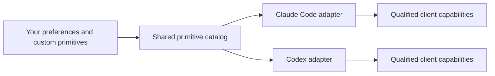

# agent-harness

[](https://github.com/JakeSelby/agent-harness/actions/workflows/ci.yml)
[](LICENSE)
[](CONTRIBUTING.md)
[](https://agent-harness.jakeselby.com)

## Your way of working, across AI agents.

A general-purpose, model-provider-agnostic harness built around you. Define how your agents work
through shared rules, skills, roles, workflows, and custom primitives—including personal stances
you can switch without rewriting your instructions.

**You own the working style.** Your preferences live outside the checkout. Choose how your agents
communicate, test, delegate, exercise autonomy, and approach decisions; keep those choices when
you change runtimes.

**Personal stances make preferences explicit and switchable.** A stance is a harness-defined
primitive: a named policy choice that can affect instructions, delegation, execution controls and
workflow behavior. It is not a Claude feature or a bundle of provider configuration presets.

**Custom primitives let you extend the harness.** Add a stance dimension or variant, author a
skill, define a role, or compose a workflow. Keep one source under `primitives/` or your configured
custom stance root. [Author a custom stance](docs/primitive-authoring.md).

**Runtime adapters carry those choices across agents.** Claude Code and Codex projections share
the same policy authority. Native settings, tool events and permission controls remain adapter
responsibilities. A stance cannot override a client's native restrictions.

**Compatibility means verified behavior.** Claude Code and Codex are this release's integration
targets. Supported clients and capabilities are listed explicitly after validation in the
[compatibility catalog](docs/compatibility.md), available as `harness compatibility --json`.
<!-- harness:compatibility:start -->
**Unqualified:** `claude-code-cli-macos`, `claude-code-vscode-macos`, `claude-code-cli-linux`, `codex-cli-macos`, `codex-vscode-macos`, `codex-desktop-macos`, `codex-cli-linux`.

**Planned:** `cursor`, `grok`.
<!-- harness:compatibility:end -->

Provider independence does not promise universal compatibility or identical model behavior.

## See a stance switch

```sh
bin/harness config set stances.delegation off
bin/harness stances --json
bin/harness sync
# Both projections now say to work inline; the shared spawn policy denies delegation.

bin/harness config set stances.delegation tiered
bin/harness stances --json
bin/harness sync
# Both projections now permit bounded gathering; native role bindings determine model and tools.
```

Claude Code reads the selected policy through its linked rule; Codex reads the same policy in
its generated instructions. The shared hook engine resolves the same choice in each runtime.
Native activation requires client trust, and tier mapping is capability-dependent. Inspect the
[demonstration](docs/stance-demo.md) and [runtime controls](docs/runtime-controls.md) for what is
advisory, implemented, or still unqualified.

Presets are only a starting point. A custom `feedback/direct.md` stance might say “Lead with the
conclusion; name the evidence and the next useful action.” Add its root to `primitive_roots`,
select `stances.feedback=direct`, and the same policy reaches both projections. The
[authoring contract](docs/primitive-authoring.md) covers alternatives, overrides and conflicts.

## Before you start

You need `git`, Python 3.9+, and an account for each runtime you use. The CLI bundles an MIT-licensed
TOML parser; it does not provide model access. macOS and Linux are integration targets; native
Windows is unsupported and WSL2 is unqualified.

[Read the getting-started guide](docs/getting-started.md).

## Install and inspect

```sh
git clone https://github.com/JakeSelby/agent-harness.git ~/repos/agent-harness
cd ~/repos/agent-harness
bin/harness init
bin/harness install --dry-run
bin/harness install
bin/harness doctor
bin/harness compatibility
```

Already have the tools? Use `bin/harness sync --dry-run`, then `bin/harness sync`. Select runtimes
with `claude.manage` and `codex.manage`; neither requires the other. Existing user files are
preserved; adopt them explicitly only after reviewing the reported conflicts. Read
[getting started](docs/getting-started.md) and [installation ownership](docs/runtime-installation.md).

## One source, native projections



`primitives/` holds rules, stances, skills, roles, workflows and presentation. `policy/` implements
shared lifecycle policy; `adapters/` binds it to runtimes. Compatibility paths under `claude/`
are generated views or links, not a second authoring catalog. Run `harness catalog` for current
inventory and source digests, and `harness stances --json` for your effective selections and
adapter coverage. Counts come from those sources rather than this README.

- [How it works](docs/how-it-works.md) and [preferences](docs/preferences.md)
- [BMad and bidirectional task continuation](docs/bmad.md)
- [Sandboxing](docs/sandboxing.md) and [workspaces](docs/workspaces.md)
- [Diagnostics and telemetry](docs/usage.md)
- [Contributing](CONTRIBUTING.md) and [the public reference](https://agent-harness.jakeselby.com)

## Verify and update

```sh
python3 bin/harness lint
python3 -m unittest discover -s tests
bin/harness generate --check
```

Use a worktree for changes: installed links may make the checkout live in the next agent session.
`harness diff` reports drift; `harness uninstall` restores owned values when they still match
what the harness last applied and preserves user conflicts. Releases and the reference site are
versioned together. Hosted agents, native memory merging and the UML viewer are deferred.
