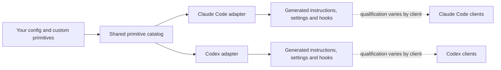

# Agent Harness

[](https://github.com/JakeSelby/agent-harness/actions/workflows/ci.yml)
[](LICENSE)
[](CONTRIBUTING.md)
[](https://agent-harness.jakeselby.com)


## The control plane for your coding agents, however you run them.


Agent Harness is the layer under your coding agents. You write your rules, skills, roles and stances once, as your own primitives. The harness projects them into Claude Code and Codex, enforces them with hooks, and keeps a ledger of what every session did and spent. It sits under whatever rules library you like and whatever orchestration you run, so you can change how your agents work without changing how you run them.

Every file it touches goes in an ownership journal, and uninstall puts things back. The same ledger exports over OTLP to Langfuse, Phoenix or Opik, off by default.

Agent Harness is not an LLM API gateway, a model provider or a replacement agent runtime. Claude
Code and Codex remain responsible for model access, native permissions and client behavior.

## What it does for you

The same six groups are held as data in [`product.json`](product.json), so this list, the reference
site and the GitHub description cannot drift apart.

### Guardrails that leave room for judgment

Hooks handle the few things that should be deterministic. Everything else stays the agent's call.

- [Graded shell commands](claude/hooks/grade-bash.py): Every command is graded from read-only to irreversible, and your autonomy stance decides which grades stop and ask.
- [Stop gate](claude/hooks/stop-gate.py): The turn doesn't end while your repo's own gate is red.
- [Fresh-context review](claude/agents/reviewer.md): Scope is checked against the ask, then quality, by agents that never saw the code, and a framework's own review spawns are held to that whatever they call themselves.
- [Secrets and personal data](primitives/rules/secrets.md): Lint catches tokens, keys and personal strings before they're committed.
- [Untrusted tool output](claude/hooks/neutralize-tool-output.py): Text that comes back from a tool is data, never instructions.
- [Sandboxing](docs/sandboxing.md): Fence the filesystem and network before you leave a loop unattended.

### Settings you own, on every runtime you run

Sync keeps a journal of what it changed and refuses to overwrite what it does not own. Uninstall puts it back. The same rules then go to both runtimes.

- [Reversible](docs/settings-ownership.md): Sync has a dry run, diff shows drift, an ownership journal records prior and applied values, and uninstall restores what it adopted.
- [Shared primitives](docs/sync-model.md): Rules, skills, roles and workflows live in one place and sync into each runtime's native settings.
- [Same policy on both](docs/runtime-controls.md): A Claude Code spawn and a Codex spawn resolve to the same delegation policy.
- [Declared integrations](docs/bmad.md): A planning framework declares itself in one descriptor. harness integration check|apply installs its overrides, and the spawn hook confines its review layers.
- [Honest compatibility](docs/compatibility.md): The catalog says which clients are qualified and where the gaps are: two runtimes today, and the headline does not claim more.
- [A worktree per agent](primitives/skills/worktree-per-agent): Parallel agents do not step on your checkout or on each other.

### See and steer what your agents spend

A hard cap cuts an agent off after it has already spent the tokens. I'd rather tell it what things cost and let it pace itself.

- [Cost postures](primitives/stances/cost): Pick frugal, balanced or max, or write your own. One table sets model, effort and a soft budget per role.
- [Model tiering](primitives/stances/delegation): Roles ask for a capability class, one of frontier, strong, standard and light, not a model name. Gathering files doesn't run on the model that reviews your code.
- [Band workers](claude/agents/worker-a.md): A spawn that names no role gets a right-sized worker instead of your most expensive model.
- [A budget in every brief](claude/hooks/brief-guard.py): Each subagent is told its expected tokens and tool calls. Finish if you're close, otherwise return what you have.
- [Live usage feed](docs/usage.md): The orchestrator sees what each turn and each subagent cost, and hears once when its context passes the size your stance sets. A decision log records what a hook decided.
- [Lean context](docs/how-it-works.md): Always-loaded instructions are capped at 225 lines, and lint fails the commit past that. Noisy tool output is filtered before it lands in the transcript.

### Answers and plans you can actually read

Most agent output is a wall of text. This puts the verdict first and the ask where you can find it.

- [Voice stances](primitives/stances/voice): Choose concise, answer-card or scannable. Same content, shaped for how you read.
- [Scannable output style](claude/output-styles/scannable.md): Verdict first, action items in one place, and status in plain words: Fixed, Partially fixed, Not fixed, Unverified.
- [Review Card plans](primitives/skills/plan-authoring): Every plan opens with a one-screen card and stops at a build gate until you say build.
- [Bounded subagent returns](primitives/skills/transcript-hygiene): Subagents come back with findings and a word cap, not their whole transcript.
- [Conciseness rules](primitives/rules/conciseness.md): Explain a decision once. Comments say why, not what.

### Rules you can measure, and prune

Every project in this field writes instructions and hopes. Here a rule nobody can observe is a rule nobody can prune, and lint says so before the commit lands.

Every rule names a deterministic detector over the agent's own transcript, or says in one line why nothing in a transcript can decide it,
and lint fails the commit otherwise. `harness usage --rules` then reports how often each rule fired,
grouped by repository and by the preference variant you had selected at the time.

- [Detector or reason](primitives/rules): Every rule names a deterministic detector over the transcript, or says in one line why nothing in a transcript can decide it. Lint fails the commit otherwise.
- [Hit rate per rule](docs/usage.md): harness usage --rules reports how often each rule fired, by repository and by the variant you had selected, and --by profile splits spend by the profile that wrote each row.
- [Cache prefix held](docs/usage.md): harness usage --by prefix reports each session's cache-miss ratio and names the turn where it jumped. It measures the prefix; nothing denies a change.
- [What is detected](claude/hooks/rule-detectors.py): Nineteen deterministic detectors read the transcript: whole-file reads, unverified pushes, secrets in a write, banned openers, non-conventional commits.
- [Caught in the act](docs/field-scan.md): The instrument has already caught two of this repository's own shipped features doing nothing. Both are filed as issues, not hidden.
- [Exports where you already look](docs/telemetry.md): The same ledger exports over OTLP, off by default, to Langfuse, Phoenix or Opik, adding the one thing they cannot see: which rule fired.

### Your preferences, as switches

Reasonable developers disagree about testing, autonomy and how much to delegate. Nine axes, each a named choice: three bind to enforcement today, the rest are prose that swaps cleanly.

- [Stance dimensions and variants](primitives/stances): Autonomy, delegation, testing, cost, voice, commits, planning, licensing and build versus buy.
- [User, project, session](docs/preferences.md): Set a default, override it for one repo, override that for one session, and see which layer set each unit and what measures it with harness selection.
- [Write your own](docs/primitive-authoring.md): A new stance dimension is a folder of Markdown files. No fork needed.
- [See one switch end to end](docs/stance-demo.md): The demo flips delegation and shows what changes in both runtimes.
- [Autonomy stances](primitives/stances/autonomy): Execute, confirm-writes or ask. The choice sets which shell-command grade stops and asks; it is enforced, not advised.
- [Judgment stays local by default](docs/runtime-controls.md): An external judgment provider is off at every decision point until you turn it on, sends only the fields you list, and one file switches every call off.

### On the way

Planned, not promised.

- **Measured against bare:** Proof set 1 runs the harness against bare Claude Code, and harness evidence verify re-derives every published figure from its rows, whatever they show.
- **The superpowers mode:** One switch hands planning and testing to Superpowers while every hook stays on, and doctor names the mode when it finds the plugin.

## The delivery loop

Seven commands carry a piece of work from a question to a merged pull request and a closed-out
session, with fresh eyes at the review step: `/research`, `/plan`, `/build`, `/review`, `/land`,
`/handoff`, `/close-out` ([workflows](primitives/workflows)). Named roles ([builder, planner, reviewer,
gatherer, designer and more](claude/agents)) each carry a model class and tool limits; the review is done
by agents that never saw the code being written; the testing and commit stances
([required tests, Conventional Commits, gated pushes, or switch them](primitives/stances/testing)) decide
how strict that loop is; and the brief, architecture and stories are [planned in public](docs/bmad.md).
Every project in this field ships a loop like it, which is why it is a section and not a claim.

## Preferences you can switch

A **stance** is a named choice about how you want an agent to work. Useful defaults ship with the
harness; each choice can be changed independently, and you can add your own dimensions.

| Preference | Choices included today |
| --- | --- |
| Autonomy | `execute`, `confirm-writes`, `ask` |
| Delegation | `tiered`, `session-model`, `off` |
| Testing | `required`, `pragmatic`, `off` |
| Cost posture | `frugal`, `balanced`, `max` |
| Reply shape | `scannable`, `concise`, `answer-card`, `off` |
| Plan ceremony | `review-card`, `light` |
| Commits | `conventional-attributed`, `conventional`, `as-you-go`, `off` |
| Licensing | `permissive-commercial`, `open-source`, `off` |
| Build versus buy | `capability-ceiling`, `off` |

Some stances are advisory instructions. Others also select implemented hooks or native settings.
`bin/harness stances --json` shows the resolved choice, adapter mode and qualification status for
each one. A stance never overrides a client's native restriction.

**Useful defaults. Preferences you can change. Primitives you can extend.**

## Try it with runtimes you already have

You need `git`, Python 3.9+, and your own account for every runtime you enable. macOS and Linux are
integration targets. Native Windows is unsupported; WSL2 is unqualified. The harness does not
provide model access.

One command clones the `stable` branch to `~/repos/agent-harness`, writes a default configuration
and previews the install. It installs nothing itself; the last thing it prints is the command that
does:

```sh
curl -fsSL https://raw.githubusercontent.com/JakeSelby/agent-harness/stable/scripts/install.sh | sh
```

Read [the script](scripts/install.sh) before you pipe it, and
[what each step does](docs/runtime-installation.md#the-one-line-installer) after. `HARNESS_CHECKOUT`
puts the checkout somewhere else.

The same path by hand, which is also the contributor's path. `stable` is always the latest release
and a `git pull` on it moves you to the next one; `main`, which this page shows, is the development
trunk and can be ahead of any release:

```sh
git clone --branch stable https://github.com/JakeSelby/agent-harness.git ~/repos/agent-harness
cd ~/repos/agent-harness

bin/harness config set claude.manage true
bin/harness config set codex.manage true
bin/harness config set vscode.manage false

bin/harness sync --dry-run
# Review every proposed link, rendered file, setting and conflict.
bin/harness sync
bin/harness doctor
```

Set either runtime to `false` if you do not use it; neither runtime requires the other. Set
`vscode.manage` deliberately too. Configuration is user-level by default: it is not scoped to the
repository you happen to be in. `sync` installs user defaults; project and session overrides stay
with that invocation and are not persisted into global projections.

If the preview reports an existing unmanaged file, stop and read the conflict. The harness does
not recommend `--adopt` by default. After syncing, start a new client session and accept native hook
trust if prompted. [Start with the full guide](docs/getting-started.md).

## Release status

**Release status:** `0.13.1` is the current stable release. Its shared engine, adapters,
configuration and hook decisions are qualified on the two required Claude Code CLI targets,
macOS and Linux, listed below; against `0.13.0` it changes the landing copy only. The Codex CLI
is outside the 0.13.1 contract until a scripted qualification round agrees with a hand-driven
one; `0.11.1` remains the last release qualified on the Codex CLI for macOS and Linux, so if you
need a qualified Codex floor, install that tag.

<!-- harness:compatibility:start -->
**Qualified:** `claude-code-cli-macos`, `claude-code-cli-linux`.

**Unqualified:** `claude-code-vscode-macos`, `claude-code-plugin-marketplace`, `codex-cli-macos`, `codex-vscode-macos`, `codex-desktop-macos`, `codex-cli-linux`.

**Planned:** `cursor`, `grok`.

A client's status is not a capability's status. Each cell is derived from that runtime's `adapters/<runtime>/capabilities.json` at generation time:

| Capability | `claude-code-cli-macos` | `claude-code-vscode-macos` | `claude-code-cli-linux` | `claude-code-plugin-marketplace` | `codex-cli-macos` | `codex-vscode-macos` | `codex-desktop-macos` | `codex-cli-linux` |
|---|---|---|---|---|---|---|---|---|
| `autonomy` | unqualified | unqualified | unqualified | unqualified | unqualified | unqualified | unqualified | unqualified |
| `build-vs-buy` | unqualified | unqualified | unqualified | unqualified | unqualified | unqualified | unqualified | unqualified |
| `commits` | unqualified | unqualified | unqualified | unqualified | unqualified | unqualified | unqualified | unqualified |
| `cost` | unqualified | unqualified | unqualified | unqualified | unqualified | unqualified | unqualified | unqualified |
| `delegation` | unqualified | unqualified | unqualified | unqualified | unqualified | unqualified | unqualified | unqualified |
| `licensing` | unqualified | unqualified | unqualified | unqualified | unqualified | unqualified | unqualified | unqualified |
| `plan-ceremony` | unqualified | unqualified | unqualified | unqualified | unqualified | unqualified | unqualified | unqualified |
| `role_execution` | unqualified | unqualified | unqualified | unqualified | unqualified | unqualified | unqualified | unqualified |
| `testing` | unqualified | unqualified | unqualified | unqualified | unqualified | unqualified | unqualified | unqualified |
| `voice` | unqualified | unqualified | unqualified | unqualified | unqualified | unqualified | unqualified | unqualified |
| tier restriction | enforced | enforced | enforced | advisory | advisory | advisory | advisory | advisory |

The last row is not a qualification state. It says whether the delegation stance's model-tier ceiling is **enforced** (a hook rewrites or refuses the spawn), **advisory** (prompt text only) or **none**, carried advisory by `primitives/skills/delegation-tiering/SKILL.md`, `primitives/stances/delegation/tiered.md`; enforced by `claude/hooks/tier-agent-spawns.py`. `enforced` is narrower than it sounds. It never reaches the session's own model: the `model` settings key is one this harness never writes (`docs/settings-ownership.md`). Within a session it rewrites a spawn only while the selected `delegation` variant is `tiered`. `off` stops the spawn instead, any other variant leaves it alone, and it acts only while the adapter's class table maps at least two models, since one class is no ladder to move a spawn down. Under every other condition the ceiling is prose, exactly as `advisory` is everywhere.
<!-- harness:compatibility:end -->

## See one switch reach both adapters

This transcript was captured with Claude and Codex enabled in disposable configuration homes.
Excerpts are shortened; paths and unrelated stances are omitted.

```console
$ bin/harness config set stances.delegation tiered
stances.delegation = "tiered"  (.../.config/agent-harness/config.json)
run `harness sync` to apply it

$ bin/harness stances --json
"delegation": {
  "variant": "tiered",
  "behavior": "# Delegation stance: tiered models\n\n**Gather with subagents ..."
}
"claude-code": { "delegation": { "mode": "instruction-and-hook", "qualification": "unqualified" } }
"codex":       { "delegation": { "mode": "instruction-and-hook", "qualification": "unqualified" } }

$ bin/harness config set stances.delegation off
stances.delegation = "off"  (.../.config/agent-harness/config.json)

$ bin/harness stances --json
"delegation": {
  "variant": "off",
  "behavior": "# Delegation stance: off\n\nDo not spawn subagents unless the user asks ..."
}

$ bin/harness sync --dry-run
stances: ... delegation=off ...
link  .../claude/rules/harness-stances/delegation.md -> .../primitives/stances/delegation/off.md
codex hooks registered; native hook trust must be accepted in the client
```

What changed here:

- **Generated configuration:** both runtime projections receive the resolved `off` policy after
  `sync`; start a new client session to load changed global instructions.
- **Implemented hook decision:** the shared spawn policy asks before any delegation under `off`, so
  only an explicit user request permits the spawn.
- **Native behavior:** qualification varies by client, as reported above. Projection generation and
  unit tests are not proof that a particular client version loaded or followed the policy.

The complete reproducible example is in the [stance demonstration](docs/stance-demo.md).

## Shared authority, native adapters



`primitives/` is the authoring authority for rules, stances, skills, roles, workflows and
presentation. `policy/` implements shared lifecycle decisions; `adapters/` translates them into
runtime-specific controls. Paths under `claude/` are generated views or compatibility links, not a
second catalog. Run `bin/harness catalog` for source digests and `bin/harness generate --check` for
projection drift.

Custom prose stances are advisory unless you also implement and register corresponding policy.
The shared [architecture-viewer capability](docs/viewer-integrations.md) is a preview that can
invoke a separately installed implementation from either runtime and keep one pinned session
across them. A local protocol 1 candidate passed process-level harness acceptance. The harness
does not bundle a viewer, and native viewer interaction and distribution/license clearance remain
unverified. Hosted agents and native memory merging are also deferred.

## Cost and measurement

The `cost` stance sets a working posture (effort, fan-out and cache habits), not a hard dollar cap.
Model access remains billed by the provider or covered by a subscription, and there is no claimed
savings benchmark. `bin/harness usage` summarizes available local session measurements, labels
partial data and leaves unavailable metrics unknown. It does not send telemetry to a service.
Read [usage and its limits](docs/usage.md).

Each variant also carries a resolved table: a model class, a reasoning effort and a soft budget for
each shared role and for each of the three work bands, which `bin/harness stances --json` prints.
A subagent brief states the budget its row expects; a subagent past it finishes or returns and says
why, and nothing is truncated. A spawn that names no role is routed to the variant's default band
worker, which is the only way a posture's effort reaches a spawn that named nothing. While a
session runs, a usage feed reports the turn's and each subagent's measured spend against those
budgets. All of it is a working posture and local measurement; none of it is a savings claim.

## Full installation and ownership

If you also want the harness to provision missing tools, use the broader installation path:

```sh
bin/harness init
bin/harness install --dry-run
bin/harness install
bin/harness doctor
```

`install` can install applications and packages as well as synchronize configuration. Review
`bin/harness install --help` first; flags can skip Homebrew, apps, VS Code or Codex. Existing
user-owned files, credentials, model choices, MCP servers and plugins are not silently replaced.

The harness tracks fields and files it owns. `uninstall` restores a previous value only when the
current value still matches what the harness last applied; conflicts and redirected links are
preserved and reported rather than overwritten. See [installation ownership](docs/runtime-installation.md)
and the [sync model](docs/sync-model.md).

## Go deeper

- [Compatibility catalog and qualification contract](docs/compatibility.md)
- [How shared primitives and adapters work](docs/how-it-works.md)
- [All preferences and stance rationale](docs/preferences.md)
- [Author a custom stance, skill, role or workflow](docs/primitive-authoring.md)
- [Runtime controls](docs/runtime-controls.md), [sandboxing](docs/sandboxing.md),
  [workspaces](docs/workspaces.md) and [always-on Remote Control servers](docs/remote-control.md)
- [Bidirectional task continuation](docs/task-continuation.md) and the
  [BMad integration](docs/bmad.md)
- [Contributing](CONTRIBUTING.md) and the [public reference](https://agent-harness.jakeselby.com)

Agent Harness uses the open-source [BMad Method](https://github.com/bmad-code-org/BMAD-METHOD)
to structure public product planning, architecture, delivery and release readiness. BMad is a
trademark of BMad Code, LLC; this project is independent and is not endorsed by BMad Code.

## Verify changes

Installed links may point at the checkout, so contribute from a managed worktree. The repository
gate is:

```sh
python3 bin/harness lint
python3 -m unittest discover -s tests
bin/harness generate --check
```

If the idea of user-owned working preferences across agents is useful, try the dry run, open an
issue with the conflict or missing primitive you found, and consider starring the project.
