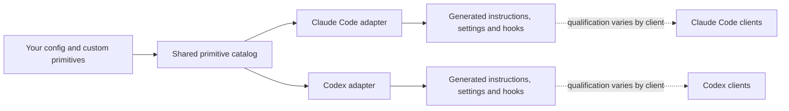

# Agent Harness

[](https://github.com/JakeSelby/agent-harness/actions/workflows/ci.yml)
[](LICENSE)
[](CONTRIBUTING.md)
[](https://agent-harness.jakeselby.com)

## Define your working preferences once. Apply them to Claude Code and Codex.

Agent Harness keeps shared instructions, skills, roles, workflows and personal preferences in one
place, then projects them into the native formats each runtime understands. You do not have to
maintain one working agreement for Claude Code and another for Codex.

**Release status:** `0.11.1` is the current stable release. Its shared engine, adapters,
configuration and hook decisions are qualified on the four required Claude Code and Codex CLI
targets listed below.

<!-- harness:compatibility:start -->
**Qualified:** `claude-code-cli-macos`, `claude-code-cli-linux`, `codex-cli-macos`, `codex-cli-linux`.

**Unqualified:** `claude-code-vscode-macos`, `codex-vscode-macos`, `codex-desktop-macos`.

**Planned:** `cursor`, `grok`.
<!-- harness:compatibility:end -->

Agent Harness is not an LLM API gateway, a model provider or a replacement agent runtime. Claude
Code and Codex remain responsible for model access, native permissions and client behavior.

## Preferences you can switch

A **stance** is a named choice about how you want an agent to work. Useful defaults ship with the
harness; each choice can be changed independently, and you can add your own dimensions.

| Preference | Choices included today |
| --- | --- |
| Autonomy | `execute`, `confirm-writes`, `ask` |
| Delegation | `tiered`, `session-model`, `off` |
| Testing | `required`, `pragmatic`, `off` |
| Cost posture | `frugal`, `balanced`, `max` |
| Reply shape | `scannable`, `answer-card`, `off` |
| Plan ceremony | `review-card`, `light` |
| Commits | `conventional-attributed`, `conventional`, `as-you-go`, `off` |
| Licensing | `permissive-commercial`, `open-source`, `off` |
| Build versus buy | `capability-ceiling`, `off` |

Some stances are advisory instructions. Others also select implemented hooks or native settings.
`bin/harness stances --json` shows the resolved choice, adapter mode and qualification status for
each one. A stance never overrides a client's native restriction.

**Useful defaults. Preferences you can change. Primitives you can extend.**

## Try it with runtimes you already have

You need `git`, Python 3.9+, and your own account for every runtime you enable. macOS and Linux are
integration targets. Native Windows is unsupported; WSL2 is unqualified. The harness does not
provide model access.

Clone the `stable` branch, explicitly select the runtimes and editor surface you want managed, then
preview every change. `stable` is always the latest release and a `git pull` on it moves you to the
next one; `main`, which this page shows, is the development trunk and can be ahead of any release:

```sh
git clone --branch stable https://github.com/JakeSelby/agent-harness.git ~/repos/agent-harness
cd ~/repos/agent-harness

bin/harness config set claude.manage true
bin/harness config set codex.manage true
bin/harness config set vscode.manage false

bin/harness sync --dry-run
# Review every proposed link, rendered file, setting and conflict.
bin/harness sync
bin/harness doctor
```

Set either runtime to `false` if you do not use it; neither runtime requires the other. Set
`vscode.manage` deliberately too. Configuration is user-level by default—it is not scoped to the
repository you happen to be in. `sync` installs user defaults; project and session overrides stay
with that invocation and are not persisted into global projections.

If the preview reports an existing unmanaged file, stop and read the conflict. The harness does
not recommend `--adopt` by default. After syncing, start a new client session and accept native hook
trust if prompted. [Start with the full guide](docs/getting-started.md).

## See one switch reach both adapters

This transcript was captured with Claude and Codex enabled in disposable configuration homes.
Excerpts are shortened; paths and unrelated stances are omitted.

```console
$ bin/harness config set stances.delegation tiered
stances.delegation = "tiered"  (.../.config/agent-harness/config.json)
run `harness sync` to apply it

$ bin/harness stances --json
"delegation": {
  "variant": "tiered",
  "behavior": "# Delegation stance: tiered models\n\n**Gather with subagents ..."
}
"claude-code": { "delegation": { "mode": "instruction-and-hook", "qualification": "unqualified" } }
"codex":       { "delegation": { "mode": "instruction-and-hook", "qualification": "unqualified" } }

$ bin/harness config set stances.delegation off
stances.delegation = "off"  (.../.config/agent-harness/config.json)

$ bin/harness stances --json
"delegation": {
  "variant": "off",
  "behavior": "# Delegation stance: off\n\nDo not spawn subagents unless the user asks ..."
}

$ bin/harness sync --dry-run
stances: ... delegation=off ...
link  .../claude/rules/harness-stances/delegation.md -> .../primitives/stances/delegation/off.md
codex hooks registered; native hook trust must be accepted in the client
```

What changed here:

- **Generated configuration:** both runtime projections receive the resolved `off` policy after
  `sync`; start a new client session to load changed global instructions.
- **Implemented hook decision:** the shared spawn policy asks before any delegation under `off`, so
  only an explicit user request permits the spawn.
- **Native behavior:** qualification varies by client, as reported above. Projection generation and
  unit tests are not proof that a particular client version loaded or followed the policy.

The complete reproducible example is in the [stance demonstration](docs/stance-demo.md).

## Shared authority, native adapters



`primitives/` is the authoring authority for rules, stances, skills, roles, workflows and
presentation. `policy/` implements shared lifecycle decisions; `adapters/` translates them into
runtime-specific controls. Paths under `claude/` are generated views or compatibility links, not a
second catalog. Run `bin/harness catalog` for source digests and `bin/harness generate --check` for
projection drift.

Custom prose stances are advisory unless you also implement and register corresponding policy.
The shared [architecture-viewer capability](docs/viewer-integrations.md) is a preview that can
invoke a separately installed implementation from either runtime and keep one pinned session
across them. A local protocol 1 candidate passed process-level harness acceptance. The harness
does not bundle a viewer, and native viewer interaction and distribution/license clearance remain
unverified. Hosted agents and native memory merging are also deferred.

## Cost and measurement

The `cost` stance sets a working posture—effort, fan-out and cache habits—not a hard dollar cap.
Model access remains billed by the provider or covered by a subscription, and there is no claimed
savings benchmark. `bin/harness usage` summarizes available local session measurements, labels
partial data and leaves unavailable metrics unknown. It does not send telemetry to a service.
Read [usage and its limits](docs/usage.md).

Each variant also carries a resolved table—a model class, a reasoning effort and a soft budget for
each shared role and for each of the three work bands—which `bin/harness stances --json` prints.
A subagent brief states the budget its row expects; a subagent past it finishes or returns and says
why, and nothing is truncated. A spawn that names no role is routed to the variant's default band
worker, which is the only way a posture's effort reaches a spawn that named nothing. While a
session runs, a usage feed reports the turn's and each subagent's measured spend against those
budgets. All of it is a working posture and local measurement; none of it is a savings claim.

## Full installation and ownership

If you also want the harness to provision missing tools, use the broader installation path:

```sh
bin/harness init
bin/harness install --dry-run
bin/harness install
bin/harness doctor
```

`install` can install applications and packages as well as synchronize configuration. Review
`bin/harness install --help` first; flags can skip Homebrew, apps, VS Code or Codex. Existing
user-owned files, credentials, model choices, MCP servers and plugins are not silently replaced.

The harness tracks fields and files it owns. `uninstall` restores a previous value only when the
current value still matches what the harness last applied; conflicts and redirected links are
preserved and reported rather than overwritten. See [installation ownership](docs/runtime-installation.md)
and the [sync model](docs/sync-model.md).

## Go deeper

- [Compatibility catalog and qualification contract](docs/compatibility.md)
- [How shared primitives and adapters work](docs/how-it-works.md)
- [All preferences and stance rationale](docs/preferences.md)
- [Author a custom stance, skill, role or workflow](docs/primitive-authoring.md)
- [Runtime controls](docs/runtime-controls.md), [sandboxing](docs/sandboxing.md) and
  [workspaces](docs/workspaces.md)
- [BMad integration and bidirectional task continuation](docs/bmad.md)
- [Contributing](CONTRIBUTING.md) and the [public reference](https://agent-harness.jakeselby.com)

Agent Harness uses the open-source [BMad Method](https://github.com/bmad-code-org/BMAD-METHOD)
to structure public product planning, architecture, delivery and release readiness. BMad is a
trademark of BMad Code, LLC; this project is independent and is not endorsed by BMad Code.

## Verify changes

Installed links may point at the checkout, so contribute from a managed worktree. The repository
gate is:

```sh
python3 bin/harness lint
python3 -m unittest discover -s tests
bin/harness generate --check
```

If the idea of user-owned working preferences across agents is useful, try the dry run, open an
issue with the conflict or missing primitive you found, and consider starring the project.
