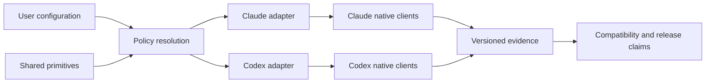

# Paradigm

Agent Harness is a **policy authority with ports and adapters**. Shared primitives and resolved policy
form the domain authority; runtime adapters translate that authority into native configuration. Native
clients are external systems whose observed behavior is evidence, not an implementation detail.

# Decisions

## AD-1 — Shared primitive authority [ADOPTED]

**Binds:** rules, skills, roles, workflows, stance definitions and adapter inputs.

**Prevents:** runtime-specific policy catalogs from becoming competing sources of truth.

**Rule:** author shared meaning once; adapters may translate but not redefine it.

## AD-2 — Resolved policy with fixed invariants [ADOPTED]

**Binds:** stance selection, hooks and runtime instructions.

**Prevents:** a preference switch from disabling truthfulness, authorization, secret protection or a
native restriction.

**Rule:** preferences choose among declared policy variants; invariants remain outside the switch.

## AD-3 — Reversible configuration ownership [ADOPTED]

**Binds:** installation, sync, drift handling and uninstall.

**Prevents:** silent loss of user-owned settings and unsafe restoration after a user edit.

**Rule:** structurally edit only declared fields, record prior and applied values, and restore only
when the current value still matches what the harness applied.

## AD-4 — Evidence-backed compatibility [ADOPTED]

**Binds:** catalog entries, native evidence, generated public summaries and release gates.

**Prevents:** tests of projections from being presented as native-client support.

**Rule:** every supported environment combination references passing evidence for the exact source
revision under evaluation; contradictory active failures block the claim.

## AD-5 — Public planning with GitHub delivery authority [ADOPTED]

**Binds:** BMad artifacts, typed IDs, GitHub issues, PR ownership and release planning.

**Prevents:** private planning state or hierarchy-dependent identifiers from becoming required to
understand a public change.

**Rule:** GitHub owns delivery state; BMad supplies immutable IDs and public artifacts linked both ways.

# Seed

- Python 3.9-compatible local CLI and standard-library-first implementation.
- `primitives/` is the authored catalog; `policy/` resolves behavior; `adapters/` project it.
- Compatibility catalogs and evidence are versioned repository data.
- Generated runtime projections are checked for drift but are not independent authorities.

# Deferred

Hosted execution, cloud control plane, native memory merging, stable editor/desktop support, additional
runtime adapters, UML visualization and semantic auto-authorization remain outside this spine's v1
commitments. Deployment and promotion channels are release operations, not core architecture.
