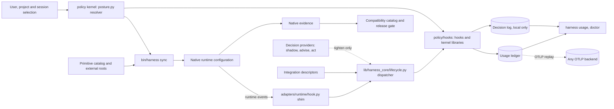
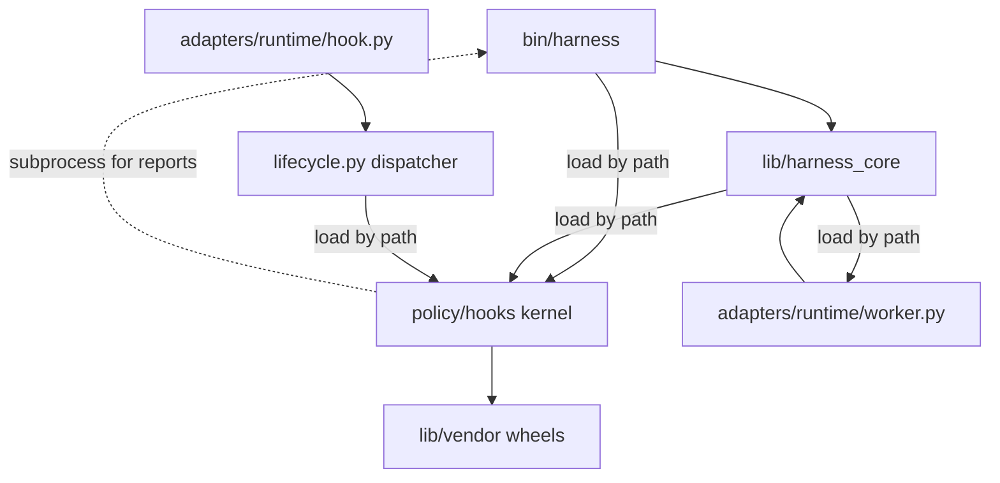
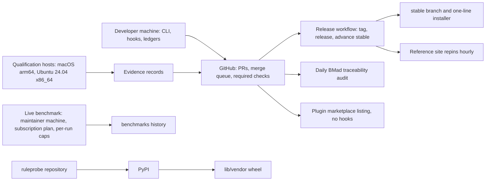

# Architecture Spine: Model Citizen

## Design Paradigm

The harness is a **policy kernel with ports and adapters**, and two ports carry its authority:
- The **projection port.** `harness sync` writes resolved policy into each runtime's native configuration.
- The **hook port.** Runtime events call one dispatcher, which runs the policy hooks. The hooks enforce
  the same resolved policy at the moment of action.

Everything observed lands in local ledgers, and every report reads from them. External
frameworks and decision providers are guests at the hook port and never own a decision.

The layers, as the code has them:
- **Policy kernel: `policy/hooks/`.**
  - Standalone, standard-library, import-cheap modules.
  - Hooks run as separate processes, so shared hook code sits beside the hooks and is loaded by file path.
  - `posture.py` is the one resolver of the stance ladder and the model ladder.
  - `pricing.py`, `telemetry.py` and `decisions.py` are kernel libraries, not hooks.
  - The kernel imports nothing above its own directory.
- **Hook dispatch: `lib/harness_core/lifecycle.py`.**
  - The event table per runtime and the tool-name aliases.
  - Composition of hook answers, including per-runtime translation. For example, it turns an `ask` into a
    `deny` on Codex.
  - It loads kernel modules by path.
  - `adapters/<runtime>/hook.py` is an eight-line shim into this dispatcher.
- **Core library: `lib/harness_core/`.**
  - Catalog, compatibility and qualification.
  - Workers, integrations, decisions, reconcile, tasks, keychain and remote control.
  - It loads kernel modules and `adapters/<runtime>/worker.py` by path.
- **CLI: `bin/harness`.**
  - The command layer: configuration loading, sync, worktrees, workspaces and the reports.
  - Today it also holds a second precedence ladder (`load_config`), which AD-2 retires.
- **Adapters: `adapters/<runtime>/`.**
  - `bindings.json`, `capabilities.json`, the hook shim, and `worker.py` for launching workers.
  - A worker may import core helpers.
- **Sources and projections.**
  - `primitives/` is the primitive catalog.
  - `claude/` links into `primitives/` and `policy/hooks/`, beside two hand-authored sources:
    `settings.template.json` and `OWNERSHIP.json`.
  - `codex/` and `vscode/` hold native settings and examples.



## Invariants & Rules

Dependency direction is a rule:
- The kernel imports nothing above itself. Its one outward reach is `lib/vendor/`, a leaf.
- The dispatcher, the core library and the CLI load kernel modules by path.
- The CLI uses the core library, and a worker may import core helpers.
- The session hook calls the CLI as a subprocess for reports (`stances --json`, `diff`, `integration
  check`, `task show`). Those command outputs are contracts, and the resolver migration in AD-2 keeps
  them.

Nothing outside the kernel resolves stances or models.



### AD-1: Shared primitive authority [ADOPTED]

- **Binds:** FR-1, FR-3, FR-10, FR-13, FR-42, FR-43, FR-68; the rules, skills, roles, workflows, stance
  definitions and adapter inputs.
- **Prevents:** runtime-specific policy catalogs becoming competing sources of truth.
- **Rule:**
  - Author shared meaning once. Adapters may translate it but never redefine it.
  - Workflow text stays runtime-neutral, so that Codex can project workflows as skills.
  - A capability a runtime lacks is declared in its `capabilities.json` and is never emulated by a
    second copy of the primitive.
    - The capability modes are `instruction`, `instruction-and-hook` and `instruction-and-setting`.
    - The tier restriction is `enforced`, `advisory` or `none`.

### AD-2: One resolver, fixed invariants [ADOPTED for invariants; resolver unification in progress]

- **Binds:** FR-2, FR-14, FR-15, FR-16; stance selection, the selection model, modes and switches.
- **Prevents:**
  - a switch disabling truthfulness, authorization, secret protection or a native restriction;
  - two precedence ladders disagreeing, which #294 records today.
- **Rule:**
  - `policy/hooks/posture.py` is the only resolver. Its precedence runs from the defaults, through the
    user and project layers, to the session.
  - Project configuration may select stances only.
    *Amended 2026-09-25:* a project file now carries the whole selection document, so it may also
    switch rules, hooks, skills, workflows and roles and name a mode (#554). Identity, permissions,
    runtime flags, `primitive_roots` and telemetry stay user-owned, and a project file that sets one
    is refused with a message naming the key. Invariants still sit outside every switch.
  - `bin/harness` stops resolving on its own and calls the resolver. #294 and #554 carry that
    migration, and no new code may read the ladder directly. The session hook reports stances through
    `bin/harness stances --json`, so that output keeps its shape across the migration.
  - Core hooks can be switched off only behind an explicit acknowledgement.
  - For modes, a developer's explicit choice shadows a mode key, while a value `harness init` wrote as a
    default does not. The resolver must therefore be able to tell the two apart. #557 picks the
    mechanism within that constraint.
    *Amended 2026-09-25, confirmed by the owner on 2026-09-25:* per #557, `config.json` records the
    stances `harness init` wrote as defaults, each with the value it wrote, under
    `init_defaults: {"stances": {name: value}}`, and each one still holding its recorded value
    resolves in a new `init` layer between the defaults and the mode. `harness init --yes` and
    a `config set` that creates the file mark every stance, interactive init marks only the answers
    Enter accepted, and `harness config set stances.NAME` or a hand edit of the value makes that
    stance typed again. A config written before this change has no
    `init_defaults`, so every stance in it stays typed and shadows a mode. This adds a key to the
    user config schema and a layer to the precedence.
  - Invariants sit outside every switch.

### AD-3: Reversible configuration ownership [ADOPTED]

- **Binds:** FR-4, FR-5, FR-17, FR-66, FR-69, FR-70; install, sync, drift handling, upgrade, uninstall.
- **Prevents:** silent loss of user-owned settings, and unsafe restoration after a user edit.
- **Rule:**
  - Edit only declared fields, structurally.
  - Record prior and applied values.
  - Restore only while the current value still matches what the harness applied.
  - Only one sync runs at a time, holding the `sync.lock` in `reconcile.py`.
  - Compare semantically for rollback, never by byte snapshot.

### AD-4: Evidence-backed compatibility [ADOPTED]

- **Binds:** FR-6, FR-7, FR-12, FR-51, FR-52, FR-53; catalog entries, native evidence, public summaries and
  release gates.
- **Prevents:**
  - tests of projections being presented as native support;
  - unrelated merges invalidating evidence.
- **Rule:**
  - Every supported target references passing evidence for the exact source revision. A contradictory
    active failure blocks the claim.
  - `SOURCE_PATHS` in `lib/harness_core/compatibility.py` is the one authority on which paths invalidate
    evidence.
  - Invalidation is scoped per runtime, through the catalog's `evidence_invalidation`:
    - only `hook.py` is private to a runtime, so a change there invalidates that runtime's targets
      together;
    - a change to `bindings.json`, `capabilities.json` or `worker.py` under either adapter invalidates
      every target, because shared code reads them for every runtime;
    - so does a change to any other shared source path.
  - Within a target, invalidation is per case, through the catalog's versioned `case_paths` map: a change
    under a path a case names makes that case stale, a change under a path no case names invalidates the
    whole record, and a record that states no map, or another map, keeps the whole-target rule (#582).
  - The catalog states are `qualified`, `unqualified`, `planned` and `unsupported`.
  - A round runs frozen on a release branch. A model-free smoke tier runs before any native case.
  - Every public surface reads its version and status from the catalog and `product.json`. The plugin
    manifests still hard-code a version, which is a migration tracked with the plugin follow-up.

### AD-5: Public planning with the design in the story file [ADOPTED; the tool contract merged in #629]

- **Binds:** FR-9, FR-64, FR-65; BMad artifacts, typed IDs, GitHub issues, PR ownership, the sync tool.
- **Prevents:**
  - private planning state being necessary to understand a public change;
  - the sync tool overwriting human-authored design.
- **Rule:**
  - GitHub owns delivery state, discussion, the summary and acceptance evidence. The story file owns the
    design.
  - The sync tool owns only the frontmatter, the H1 and the managed block. Everything after the block is
    preserved byte for byte.
  - A legacy stub is recognised positively. Any other file without a well-formed block is refused.

### AD-6: One effective policy for every consumer [PARTIAL: the CLI's ladder retires under AD-2]

- **Binds:** FR-2, FR-27, FR-32, FR-68; hooks, rendered files, telemetry, workers and the output style.
- **Prevents:** a component acting on a variant other than the one the resolver chose. An audit found
  this in a hook, in the output style and in telemetry.
- **Rule:**
  - Every consumer asks `posture.py` for the effective policy.
  - No component parses selection files itself.

### AD-7: What a hook may and may not do [ADOPTED]

- **Binds:** FR-30 to FR-32, FR-35 to FR-39, FR-41, FR-48; every enforcement mechanism.
- **Prevents:** designs that depend on runtime powers that do not exist.
- **Rule:**
  - Enforcement may rely on:
    - pre-tool deny, ask or input rewrite, wherever the runtime supports each;
    - a stop-event block;
    - post-tool and session context notices;
    - role workers;
    - the local ledgers.
  - No design may replace a built-in tool's result or trigger compaction from a hook.
  - The event table in `lifecycle.py` is the one declaration of which events each runtime raises. It
    changes only after a probe on the named client version.
  - A gap is declared in `capabilities.json`, never papered over.

### AD-8: Constrained roles run only as isolated role workers [ADOPTED; two unguarded paths named]

- **Binds:** FR-40, FR-41, FR-42; the gatherer, planner, reviewer and spec-reviewer, and every spawn path.
- **Prevents:**
  - a native subagent inheriting its parent's permissions;
  - a worker that both reads a workspace and fetches the web.
- **Rule:**
  - Constrained roles run as separate processes, with restricted tools, declared input roots, deadlines
    and private logs.
  - The gatherer runs offline.
  - The harness publishes a planner's output to a new path.
  - Every spawn path is guarded or declared unguarded. Two paths are named gaps:
    - the Workflow tool's `agent()` (#576);
    - the plugin channel, which installs constrained roles as native agents with no hook (the plugin
      follow-up under #634).
    *Amended 2026-09-25:* the Workflow tool's launch is guarded (#576): the pre-tool hook reads the script
    and refuses one naming a constrained role, so the remaining gap there is band routing of its
    `agent()` calls, not confinement.

### AD-9: Checks bind subagents; decisions flow up [ADOPTED]

- **Binds:** FR-33; every gate, approval and governance check.
- **Prevents:** a subagent asking the user directly, or skipping a check its orchestrator is bound by.
- **Rule:**
  - A check that binds a session binds its subagents.
  - Each level decides what it can and returns the rest as pending.
  - Only the top session asks the user.

### AD-10: Integrations are descriptors bound at the hook port [ADOPTED for BMad; the viewer migrates]

- **Binds:** FR-45, FR-46; BMad, and every new framework.
- **Prevents:**
  - bespoke CLI code for each framework;
  - confinement that depends on prompt text a runtime may paraphrase.
- **Rule:**
  - A framework emits intents only.
  - A new integration is a data descriptor in `policy/integrations/`. It states the framework, the
    version pin, how its spawns are recognised, the role mapping and the input roots.
  - Confinement keys on the descriptor's mapping and a session-level signal.
  - The architecture viewer predates the contract (it lives in `lib/harness_core/upstream_viewer.py`
    and `integrations/architecture-viewer/`). It moves to a descriptor when its mailbox adapter lands.

### AD-11: Local ledgers are the system of record, and grow compatibly [PARTIAL: schema version planned under #636]

- **Binds:** FR-11, FR-23 to FR-27, FR-66; usage, pricing, the decision log, export.
- **Prevents:**
  - history lost to backend retention or transcript expiry;
  - an export failure blocking an agent;
  - an upgrade leaving old rows unreadable.
- **Rule:**
  - Hooks append rows with a locked or `O_APPEND` single write.
  - The only rewrite of a ledger is the usage worker's `upsert`, which runs under the ledger lock through a
    temporary file and an atomic replace, so no row is lost.
  - The decision log is append-only, and it is never exported.
  - A backend is a replica, rebuilt by replay.
  - Export is OTLP only, off by default, standard library only, and never blocks a hook.
  - Its settings live in the `telemetry` block, never in a stance.
  - Codex native export stays unauthenticated-only until Codex offers header indirection.
  - Schema changes are additive:
    - rows carry a schema version from the next ledger change on;
    - readers tolerate unknown fields;
    - a rename ships with a fold map, as renamed detector ids already do.

### AD-12: Measurement invariants [ADOPTED; estimand labels planned for v0.14.0, soft-estimate report for v0.15.0]

- **Binds:** FR-24, FR-55 to FR-58; the benchmark runner, pricing, usage reports and published evidence.
- **Prevents:** comparisons contaminated by model drift, profile leakage or double counting; a modelled
  estimate read as a measurement.
- **Rule:**
  - Compare ratios across days, never dollars. Dollars are list-price equivalents.
  - Arms differ only by environment. Each fence is proved before scoring, and no tagged sync touches a
    live profile.
  - Unknown and unpriced values are never zero. An errored run is never a failure.
  - A session row is never summed with its subagent rows. A subagent's cost comes from its own
    transcript.
  - Micro-tier rows never enter the production series.
  - Every row records the provenance of its arm. Ablations are declared in an ablation manifest, which
    lists arms and is distinct from a module's manifest (AD-22).
  - Every figure carries an estimand label. (Amended 2026-09-24. The labels land in v0.14.0 with
    attribution; the soft-estimate report and series land in v0.15.0.)
    - **Measured:** a count read directly from recorded rows, or an estimate from runs. Each names the
      fingerprint it covers; an estimate also carries n and an interval.
    - **Unattributed:** a qualifier on a figure from rows with no fingerprint. It supports only
      whole-profile statements.
    - **Soft estimate:** it depends on an assumption the run does not observe, such as the user following
      advice, and a named estimator computes it.
    - **Unmeasured:** there is no instrument.
  - The soft series is never pooled with the measured one.
  - Estimand labels are orthogonal to FR-11's known, partial, unavailable and failed, which describe a
    field's availability. Both apply to a figure.

### AD-13: Detector logic lives in `ruleprobe` [ADOPTED; declarative loading in the harness planned]

- **Binds:** FR-19 to FR-22, FR-67; the detector registry, lint and usage reports.
- **Prevents:** the harness and the standalone instrument disagreeing about whether a rule fired.
- **Rule:**
  - The harness binds rules to detectors, and vendors a pinned `ruleprobe` wheel that it never forks.
  - A `ruleprobe` release means a harness version bump.
  - Declarative detectors are data. `ruleprobe` reads them today. When the harness loads them (planned),
    it reads them through the same engine.

### AD-14: For cost, hooks only route and refuse frontier [ADOPTED]

- **Binds:** FR-28 to FR-34; postures, capability classes, band workers and briefs.
- **Prevents:** spend caps that cripple long tasks, and roles hard-wired to model names.
- **Rule:**
  - For cost, hooks enforce exactly two things:
    - routing unnamed spawns to the posture's default band;
    - refusing an undeclared `frontier` request.
  - Budgets, feeds and nudges are information. No hook denies for cost.
  - Roles name capability classes, and adapter bindings name models.

### AD-15: Decision providers are subordinate [ADOPTED for the contract; act consumers planned]

- **Binds:** FR-47 to FR-50; every decision point and provider.
- **Prevents:** a judge relaxing a guardrail; a stale threshold acting on a changed model; an `act`
  stage becoming a deny on a runtime that cannot ask.
- **Rule:**
  - The deterministic answer is authoritative. A provider advances a stage only by its written
    criterion.
  - At `act`, a provider may only tighten:
    - at a pre-tool point, an allow becomes an ask;
    - at the stop point, an allowed stop becomes a block that returns the turn to the agent with the
      provider's reason.

    It never denies a tool call, and it never releases a block.
  - Wherever an `ask` would not reach the user, a pre-tool point cannot use `act` and stays at `advise`.
    That covers Codex, which turns an ask into a deny, and Claude Code under `auto` or `bypass`, which
    ignore an ask.
  - Every error or timeout fails open to the deterministic answer.
  - Thresholds are keyed to the pinned model id and the question-pack version.
  - The egress allowlist is empty by default.
  - No model trains on a third-party provider's output.
  - Evidence changes a stance only as a proposal the developer applies.

### AD-16: Parallel writers coordinate through shared, recorded state [PLANNED: backlog, #542, #543]

- **Binds:** FR-44, FR-63; builders, worktrees, the decision log, the session archive.
- **Prevents:** overlapping edits between sibling agents, and coordination chat that bills as prompts.
- **Rule:**
  - Parallel writers declare their paths, including new ones.
  - Every overlap is logged where the runtime has a pre-write hook. Elsewhere, the adapter declares the
    gap.
  - Whether an overlap warns or denies is a policy variant.
  - There is no peer messaging. Archive recall is pull-only.

### AD-17: Behaviour read from client internals is pinned and checked [PARTIAL: pin planned under #636]

- **Binds:** FR-60, FR-30, FR-41; Remote Control hosts and the Workflow tool guard.
- **Prevents:** a runtime update silently breaking a feature built on undocumented client behaviour.
- **Rule:**
  - Behaviour learned by reading client internals is pinned to the client versions it was verified on,
    and `doctor` warns when the running client is outside them.
  - Such features stay outside the v1 stable surface.
  - Today `lib/harness_core/remote_control.py` names its versions only in comments. The pin and the
    doctor check are the migration.

### AD-18: Shared-machine concurrency and writes [PARTIAL: helper and per-session counter planned]

- **Binds:** FR-9, FR-36, FR-38, FR-44, FR-59, FR-62; every writer on a machine running many sessions.
- **Prevents:** sessions corrupting each other's state, one session's scratch reddening every gate,
  duplicate IDs, and half-written files.
- **Rule:**
  - State that belongs to a session is keyed per session. The stop gate's release counter, which is
    kept per checkout today, migrates to this.
  - A whole-file rewrite goes through one shared helper that writes a temporary file, fsyncs it, replaces
    atomically and keeps the mode. This covers configuration, the ownership journal, the issue map, story
    files, benchmark history and kernel state files.
    - The helper lives in the kernel, so kernel writers can load it by path too.
    - The writers in `bin/harness`, `reconcile.py`, `cost_bench.py`, `posture.py`, `stop-gate.py`,
      `usage-feed.py` and `usage-log.py` converge on it (#636).
    - The sync tool already writes this way (#629).
  - A batch rewrite, such as sync across runtimes or `upgrade`, restores what it already wrote when a later
    write fails.
  - Ledgers follow AD-11.
  - ID reservation surveys every reachable issue map.
  - Untracked scratch is never linted as tracked content.
  - Every runtime launched under a substituted HOME gets a throwaway keychain, or fails closed. Workers use
    `harness_core.keychain`. The native acceptance driver has its own implementation, which also fails
    closed, and converges on the module.
  - The live checkout carries only merged content.

### AD-19: Distribution channels carry no second authority [PARTIAL: plugin manifest version]

- **Binds:** FR-17, FR-18, FR-53, FR-54.
- **Prevents:**
  - plugin hooks double-firing with user hooks;
  - release surfaces disagreeing about version or status.
- **Rule:**
  - The plugin carries no hooks, and enforcement needs `harness sync`.
  - The installer installs from `stable`, which only fast-forwards to release tags.
  - Landing, README and About copy come from `product.json` only.

### AD-20: Continuity never moves authority [ADOPTED]

- **Binds:** FR-8, FR-59, FR-61; task handoff, close-out and workspaces.
- **Prevents:** an approval or a verification claim crossing a session or runtime boundary.
- **Rule:**
  - Task state is neutral and non-authoritative.
  - A changed shared plan invalidates prior verification.
  - Approvals never transfer.
  - A workspace shares history by pointing its folders' project keys at one store, and never merges an
    existing store.

### AD-21: Dependencies [ADOPTED]

- **Binds:** all.
- **Prevents:** an unreviewed dependency entering a tool that installs into developers' runtimes.
- **Rule:**
  - Use the standard library first, on a Python 3.9 floor.
  - Third-party code enters only as a pinned wheel in `lib/vendor/`, loaded by path, after a licensing
    review. There are no package-manager dependencies at runtime.

### AD-22: Modules declare a manifest [PLANNED: fields and checks v0.14.0, #554; scorecard v0.15.0; slots and adapters v0.16.0]

- **Binds:** FR-15, FR-16, FR-19, FR-58; every switchable module, the selection document and the
  scorecard.
- **Prevents:** a module reported as working with nothing measuring it; two modules taking one slot
  unnoticed; results from one profile read as another's; a second resolver.
- **Rule:**
  - Every module declares a manifest with six fields: claims, surface, instruments, slot, dependencies and
    conflicts.
  - Each manifest sits beside its module's source: primitives in the catalog (AD-1), hooks in
    `policy/hooks/`. The one resolver, `policy/hooks/posture.py` (AD-2, AD-6), reads both and resolves
    dependencies and conflicts.
  - A conflict never switches off a fixed invariant. It switches off a core hook only with AD-2's
    acknowledgement.
  - Two switched-on modules claiming one slot is a resolution error, unless one of them declares that it
    cedes the slot.
  - A module with no instrument reports as unmeasured, never as working.
  - The profile fingerprint is a digest of the resolved selection:
    - each switched-on module, with its version or content digest;
    - the stance variants;
    - the configuration values that reach the model or the hooks;
    - the harness version.

### AD-23: Observation adds nothing to any arm's model context, and every new row is attributable [PLANNED: v0.14.0, #482]

- **Binds:** FR-11, FR-23, FR-27, FR-56, FR-58; the observation layer, the ledgers, the decision log and
  every benchmark arm.
- **Prevents:** a baseline observed differently from the arm it is compared against; observation changing
  what it measures; a cost or a decision that no module owns.
- **Rule:**
  - Observation runs in every arm, bare included, through an observation-only hook path. That path appends
    to the ledger, prints nothing, adds no context and returns no decision.
  - **Registration:** observation has its own registered hook entry point beside `hook.py`, and is not
    routed through the dispatcher. It reads which events each runtime raises from the same event table
    AD-7 names as the one declaration, so the two entry points cannot disagree on events.
    *Amended 2026-09-25, confirmed by the owner on 2026-09-25:* #791 ships the entry point, its registration
    built from that table and the bare arm's install, but `harness sync` does not yet register it beside
    `hook.py`. Registering it would start a second process on every hook event for every user, make Codex
    users re-trust their hooks, and break tests that assume one entry per event. A follow-up issue adds
    opt-in registration; until then only `bare_install` writes it, and nothing outside the tests calls that.
  - **Failure:** it fails open and silent. On any exception it exits 0 with no output, never a deny, a
    block or a `systemMessage`. The error goes to a local error log only.
  - In the bare arm, only the observation-only path is installed.
  - Context-emitting handlers, such as `neutralize-tool-output`, the `harness-session` notices and
    `stop-gate`, are enforcement or advisory modules, never observation. Observation never rides on them.
  - A test drives a scripted session against a recorded model through every hook event the arm installs:
    session start, prompt submit, pre and post tool use, subagent stop, and stop. It compares every model
    request with observation on and off. Each must be byte-identical after timestamps and session ids are
    normalised. It runs per arm: bare, and each harness profile under test.
  - Every new ledger row carries the profile fingerprint (AD-22). The fields are additive under AD-11, and
    older rows read as unattributed.
  - Usage rows carry per-module attribution of context tokens. That attribution is an estimate and carries
    AD-12's soft-estimate label.
  - Decision-log rows carry the attribution of hook decisions, not token counts.
  - Adherence events are observation, not instruction.

### AD-24: The brand is Model Citizen; stable identifiers keep agent-harness [PLANNED: v0.14.0, #875]

- **Binds:** FR-9, FR-17, FR-18, FR-25, FR-53, FR-54, FR-66; the CLI name, the plugin ID, living copy,
  on-disk state, planning IDs and telemetry.
- **Prevents:** an install, uninstall or reconcile that can no longer find what it wrote; a dashboard that
  stops matching; planning anchors and dated records rewritten by a rename; a user whose `harness` command
  or plugin stops working without notice.
- **Rule:**
  - The product's name in living copy and public addresses is Model Citizen, and its slug is
    `model-citizen`.
  - `citizen` is the command, and `harness` stays a supported alias with no deprecation. `bin/harness`
    stays the real file, because hooks and the installer locate the checkout by that path; `bin/citizen`
    points at it. Removing `harness` needs a major under the compatibility policy.
  - The plugin ID is `model-citizen@model-citizen`. Doctor recognizes `agent-harness@agent-harness` too,
    and warns when both are enabled.
  - These keep `agent-harness`: on-disk names (`~/.config/agent-harness`, `.agent-harness/`,
    `~/.local/state/agent-harness/`, launchd labels, install markers and managed blocks), the `AH-` IDs,
    the issue map's slug, the planning directory names, telemetry's `service.name`, and every dated record.
    Renaming any of them needs an automatic, reversible migration or a major with notice.
  - The lower-case category noun "agent harness" is not the brand, and stays.

## Consistency Conventions

| Concern | Convention |
| --- | --- |
| Where logic goes | Logic a hook needs at event time goes in the kernel, `policy/hooks/`, as an import-cheap, standard-library module. CLI-only logic goes in `lib/harness_core/`. `bin/harness` stays a command layer and gains no new domain logic. |
| Hook ids | The runtime registers `adapters/<runtime>/hook.py` and, beside it, the observation entry point (AD-23), which bypasses the dispatcher. A hook id is the name of a `policy/hooks/` script that the dispatcher's table invokes for an event. Every other module there is a kernel library: `posture`, `pricing`, `telemetry`, `decisions`, `filter-lines`, `otel-headers`, `rule-detectors`, `allow-readonly-bash`, `adherence` and `usage-log` as loaded. The named decision points are listed in `policy/hooks/decisions.py`, the authority. `lib/harness_core/decisions/controls.py` mirrors that list, and a test keeps the two in step. Switches apply in the dispatcher, never inside a script. |
| Hook cost | Kernel modules do no work at import. The dispatcher sets per-event timeouts. Each hook's p95 wall time is measured against the NFR-16 bound. |
| Status words | Catalog states are `qualified`, `unqualified`, `planned` and `unsupported`. Capability modes are `instruction`, `instruction-and-hook` and `instruction-and-setting`. The tier restriction is `enforced`, `advisory` or `none`. Evidence results are `passed`, `failed` and `unverified`. Decision stages are `off`, `shadow`, `advise` and `act`. Estimand labels are measured, soft estimate and unmeasured, with unattributed as a qualifier (AD-12), orthogonal to FR-11's known, partial, unavailable and failed. Documentation shows "preview" for an unqualified surface. |
| Data and formats | Ledgers are JSON lines with ISO-8601 UTC timestamps. Dollars carry `price_as_of`. Unknown values are `null`, never `0`. Issue numbers are keyed `github_number`. |
| Configuration | One `config.json` per user, plus project selections. Secrets come from the environment or a headers file. |
| Failure posture | Enforcement hooks fail closed where the runtime allows it, and say so. Providers, exports and nudges fail open. A timeout never yields a clean result. |
| Failure posture: observation | The observation entry point fails open and silent: exit 0, no output, no decision, no `systemMessage`. Errors go to a local error log only (AD-23). |
| Standing context | Always-loaded context stays within 200 lines and 4,202 tokens. A new resident line needs a deferral or a trade. |
| Documentation | Explain once at the authority, and point to it elsewhere. Every change under a governed root carries a changelog fragment. |

## Stack

| Name | Version |
| --- | --- |
| Python (floor) | 3.9 |
| Python (newest tested) | 3.14 |
| ruleprobe (vendored wheel) | 0.1.0 |
| tomlkit (vendored wheel) | 0.15.1 |
| Claude Code CLI (last qualified evidence, 0.11.1) | 2.1.273 on macOS, 2.1.278 on Linux |
| Codex CLI (last qualified evidence, 0.11.1) | 0.154.0-alpha.6.2 on macOS, 0.155.1 on Linux |
| Claude Code CLI (Remote Control behaviour verified on, AD-17) | 2.1.278 to 2.1.280 |
| BMad Method (repository planning only) | 6.12.0 |

## Structural Seed

```text
bin/harness                   # command layer; today also a second precedence ladder (AD-2)
lib/harness_core/             # core library, lifecycle.py dispatcher, workers, compatibility
lib/vendor/                   # pinned wheels (AD-21)
policy/hooks/                 # policy kernel: hooks plus kernel libraries (posture, pricing, ...)
policy/integrations/          # integration descriptors (AD-10)
policy/prices.json            # dated, overridable price table
adapters/<runtime>/           # bindings.json, capabilities.json, hook.py shim, worker.py
integrations/                 # pre-contract integration code (architecture viewer)
primitives/                   # rules, skills, roles, workflows, stances, presentation, constraints.json
compatibility/                # catalog.json, evidence/, freeze.json, lifecycle-baseline.json
benchmarks/                   # static estimate, task set, history
claude/                       # links into primitives and hooks, plus hand-authored templates
codex/, vscode/, templates/   # native settings, examples and the repository template
_bmad-output/                 # public planning corpus
```



**Operational envelope**
- **Runtime.** The harness runs only on the developer's machine, on macOS or Linux. `bin/harness` refuses
  to run on native Windows.
- **CI.** Each pull request, and the merge queue, runs lint, tests, issue ownership, the landing-copy
  check, the detector corpus and the smoke tier. CI uses the runner's system Python.
  - The Python 3.9 and 3.14 matrix is proven by the release lifecycle runs, not by every pull request.
  - A 3.9 syntax check on each pull request is a gap, tracked under NFR-2.
- **Scheduled.** A daily, non-required BMad traceability audit runs.
- **Releases.** Releases are cut by milestone. The release workflow runs only after qualification and
  then advances `stable`.
- **Live benchmarks.** They run on the maintainer's machine under a subscription plan, with per-run and
  per-set caps.

## Capability → Architecture Map

| Capability / Area | Lives in | Governed by |
| --- | --- | --- |
| Primitives and projection (FR-1, FR-3, FR-10, FR-13) | `primitives/`, `lib/harness_core/catalog.py`, `importer.py`, `collisions.py`, `adapters/` | AD-1, AD-7 |
| Stances and selection (FR-2, FR-14 to FR-16) | `policy/hooks/posture.py`, `primitives/constraints.json`, `bin/harness` `load_config` (retiring) | AD-2, AD-6, AD-22 |
| Configuration lifecycle (FR-4, FR-5, FR-17, FR-66, FR-69, FR-70) | `bin/harness` (sync, init, config), `lib/harness_core/reconcile.py`, `compatibility/migration.json` | AD-3, AD-18 |
| Distribution (FR-17, FR-18, FR-53, FR-54) | `scripts/install.sh`, `.claude-plugin/`, `product.json`, `scripts/advance_stable.py`, `scripts/sync_about.py` | AD-19, AD-24 |
| Measured rules (FR-19 to FR-22, FR-67) | `policy/hooks/rule-detectors.py`, `lib/vendor/ruleprobe` | AD-13, AD-22 |
| Ledgers, pricing, telemetry (FR-11, FR-23 to FR-27) | `policy/hooks/usage-log.py`, `pricing.py`, `telemetry.py`, `decisions.py`, `otel-headers.py` | AD-11, AD-12, AD-23 |
| Cost posture (FR-28 to FR-34) | `tier-agent-spawns.py`, `brief-guard.py`, `usage-feed.py`, `posture.py`, `adapters/*/bindings.json` | AD-14 |
| Guardrails (FR-35 to FR-39) | `grade-bash.py`, `stop-gate.py`, `neutralize-tool-output.py`, `filter-output.py`, `allow-readonly-bash.py`, `lifecycle.py` | AD-7, AD-18 |
| Role workers and the delivery loop (FR-40 to FR-44, FR-68) | `lib/harness_core/workers.py`, `primitives/workflows/`, `validate-plan-card.py`, `bin/harness` worktree | AD-1, AD-8, AD-9, AD-16 |
| Integrations (FR-45, FR-46) | `policy/integrations/`, `lib/harness_core/integrations.py`, `frameworks.py`, `upstream_viewer.py` | AD-10 |
| Decision providers (FR-47 to FR-50) | `lib/harness_core/decision.py`, `lib/harness_core/decisions/`, `policy/hooks/decisions.py` | AD-15 |
| Compatibility and release (FR-6, FR-7, FR-12, FR-51, FR-52) | `lib/harness_core/compatibility.py`, `qualification.py`, `compatibility/`, `scripts/` | AD-4 |
| Benchmarks (FR-55 to FR-58) | `scripts/cost_bench.py`, `benchmarks/` | AD-12, AD-22, AD-23 |
| Session operations (FR-8, FR-59 to FR-63) | `tasks.py`, `remote_control.py`, `keychain.py`, `bin/harness` workspace, workflows | AD-16, AD-17, AD-18, AD-20 |
| Public planning (FR-9, FR-64, FR-65) | `scripts/bmad_issue_sync.py`, `.github/scripts/check_issue_ownership.py`, `_bmad-output/` | AD-5, AD-18 |

## Deferred

- **Mode precedence mechanism.** #557 decides it, within the AD-2 constraint.
- **Floor semantics for core hook ids.** Plain override holds until the selection model decides.
- **Codex prompt-submit and subagent events.** The event table stays as declared until a probe on the
  current client settles the disputed support (AD-7).
- **The session archive's row format.** The #541 spike decides it, bound by AD-11 and AD-16.
- **Semantic retrieval.** Deferred until the #546 reopen criteria are met.
- **Additional runtimes.** Each must meet AD-1 and AD-7 at equal depth.
- **The team surface and a hosted control plane.** Both come after 1.0.
- **Capability-level qualification.** Qualification stays per target until it is decided before 1.0.
- **A 3.9 syntax check on each pull request.** It stays a gap until CI adds the matrix. It is listed
  under the operational envelope.
