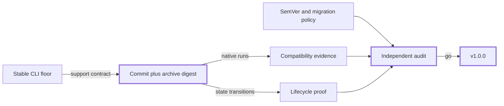

# Defensible v1.0.0 release program

> Ship v1.0.0 with a narrow stable CLI promise, one identified release artifact, proven lifecycle
> recovery, public compatibility rules, and an independent audit. Existing 0.9 evidence is input,
> not proof of the final candidate.
> **Effort:** five release stories · **Risk:** medium · **Blast radius:** release and support contract

## At a glance

- **Outcome** — A defensible v1.0.0 release for Claude Code CLI and Codex CLI on macOS and Linux.
- **Approach** — Freeze one candidate, prove its matrix and lifecycle, audit it, then publish it unchanged.
- **Touches** — Compatibility evidence, release policy, lifecycle tests, docs, metadata, tag, and package.
- **New deps** — No runtime dependency; release work adds a candidate manifest and independent reviewer.
- **Not in scope** — Stable editor/desktop support, UML viewer, new adapters, or adoption-channel execution.
- **Exit test** — Five stories close against one commit and archive digest; #211 publishes those exact bytes.
- **Open question** — None; issue #193 approved the stable floor and preview boundary.

## System design

The tag, package, catalog, documentation, and release notes all point to the audited candidate.

## Steps

1. **[Freeze the candidate and matrix](#step-1--freeze-the-candidate-and-matrix)** — issue #207.
   *Exit:* one candidate record pins commit, archive digest, clients, OS, CPU, shell, install, and Python.
2. **[Publish the compatibility contract](#step-2--publish-the-compatibility-contract)** — issue #208.
   *Exit:* SemVer, deprecation, migration, and exception rules are linked from release documentation.
3. **[Prove lifecycle recovery](#step-3--prove-lifecycle-recovery)** — issue #209.
   *Exit:* install, 0.9 upgrade, repeat sync, rollback, and uninstall pass without unrelated-file loss.
4. **[Run the independent audit](#step-4--run-the-independent-audit)** — issue #210.
   *Exit:* artifact, security, licensing, docs, evidence, and recovery have no blocking findings.
5. **[Publish the audited bytes](#step-5--publish-the-audited-bytes)** — issue #211.
   *Exit:* tag, package, changelog, catalog, and GitHub release identify and smoke-test the same revision.

## Decisions

None — the stable support floor and preview-client boundary were approved in issue #193.

## Risks

- A candidate change invalidates audit sign-off; freeze a new record and rerun the audit before release.
- Lifecycle proof finds user-state loss; block release until the recovery defect and regression test land.
- Audit and release metadata disagree; the immutable candidate wins and every public surface is corrected.

---

# Addendum

## Step 1 — Freeze the candidate and matrix

Issue [#207](https://github.com/JakeSelby/agent-harness/issues/207) owns the final support table and
evidence run. It first commits `compatibility/v1.0.0-candidate.json` with the source commit, the
SHA-256 of a deterministic release archive, and the exact matrix. The reference environments are
the current stable macOS major on Apple silicon with zsh and Ubuntu 24.04 LTS on x86_64 with bash.
Run Python 3.9 and the newest stable Python available at freeze. Pin the newest supported stable
Claude Code CLI and Codex CLI versions available at freeze and use the documented primary install
channel. Any broader macOS or Linux claim remains best-effort unless separately evidenced.

Reuse evidence structure from #98, #185, #187, and #188, but rerun all four stable CLI/OS tuples
against that candidate record. Record every selected version, architecture, shell, install channel,
command, result, and evidence digest. Set editor and desktop catalog rows to `required_for_release:
false`; they remain preview regardless of whether current evidence passes.

## Step 2 — Publish the compatibility contract

Issue [#208](https://github.com/JakeSelby/agent-harness/issues/208) defines which public interfaces
SemVer protects and how a contributor handles deprecation, migration, emergency security fixes, and
generated configuration. The policy must distinguish source compatibility, generated-file shape,
CLI behavior, support status, and evidence validity rather than promising that every internal file is
frozen forever.

## Step 3 — Prove lifecycle recovery

Issue [#209](https://github.com/JakeSelby/agent-harness/issues/209) runs the supported state changes
from clean install through uninstall. Start from immutable tag `v0.9.0` and record its commit and
source-archive digest before upgrade and rollback. Retain unrelated settings as sentinels and verify
ownership/conflict diagnostics. A repeat sync must produce no managed diff. Test every supported
Python version in the candidate record on both reference environments, not only the endpoints.

Rollback must restore the v0.9.0 executable or source checkout, managed files, generated projections,
configuration ownership journal, and effective behavior. It must preserve unrelated configuration,
adopted backups, user edits outside harness ownership, and visible conflict state. Interrupt install,
sync, upgrade, rollback, and uninstall after representative writes and prove the documented recovery
path returns to either the complete prior state or complete candidate state.

## Step 4 — Run the independent audit

Issue [#210](https://github.com/JakeSelby/agent-harness/issues/210) is a context-independent review by
a human reviewer or a different model family that did not implement the candidate. Retain reviewer
identity, review inputs, findings, dispositions, reruns, and signed go/no-go in a public audit artifact.
Reconcile #94–#100, the five v1 stories, the exact candidate archive, package contents, checksums,
secret scan, dependency vulnerability and license review, third-party notices, workflow permissions,
provenance, README first-run path, support claims, migration instructions, and recovery evidence.

Any candidate commit or archive-digest change invalidates the entire audit verdict. Before audit,
qualification may use a written evidence-impact record, but changes to the installer, generator,
packaging, shared primitives, compatibility policy, or support contract require the complete matrix
and lifecycle suite to rerun. Uncertain impact always triggers the broader rerun.

## Step 5 — Publish the audited bytes

Issue [#211](https://github.com/JakeSelby/agent-harness/issues/211) owns the release transaction. The
candidate commit becomes the immutable tag. The release workflow deterministically rebuilds the
candidate archive, refuses a digest mismatch, and publishes that verified archive with checksums;
metadata, changelog, catalog, notes, and install/rollback commands must agree with it.

Publish in this order: immutable tag, verified GitHub release artifact, reference-site pin, then
project-website metadata. Stop on the first failed surface. A tag or artifact mismatch is never repaired
by moving the tag: mark the failed release clearly and use the SemVer policy for the corrective release.
Mutable sites roll back through their prior immutable pins. Record each publication identity so a
partial release can be resumed or reversed without guessing.

## Sequencing and ownership

- #207 records the candidate before #209 begins; #208 may proceed in parallel until its policy bytes
  are folded into the candidate, at which point #207 and #209 rerun any affected gates.
- #210 starts only when those three stories are complete and the candidate is frozen.
- #211 starts only after #210 records a go verdict; any candidate change returns to the affected gate.
- The [v1.0.0 milestone](https://github.com/JakeSelby/agent-harness/milestone/1) is the progress view;
  GitHub issues remain delivery authority and BMad artifacts retain immutable planning identity.
- Epic [#206](https://github.com/JakeSelby/agent-harness/issues/206) is a child of the completed
  provider-agnostic program #93. Closing #93 remains historical and does not imply v1 is already done.

## Post-v1 programs

- [#212](https://github.com/JakeSelby/agent-harness/issues/212) stages adoption through a two-runtime
  proof (#213), a focused developer cohort (#214), and broader launch only after feedback closes (#215).
- [#216](https://github.com/JakeSelby/agent-harness/issues/216) keeps editor and desktop graduation
  separate from v1; #217 evaluates each client independently against stable graduation gates.
- Neither program can expand the v1 support claim without a later compatibility decision and evidence.

## Review disposition

- The release review added candidate and archive identity, reproducible matrix dimensions, complete
  rollback invariants, supply-chain checks, audit independence, conservative evidence invalidation,
  exact-byte publication, and partial-publication recovery to issues #207–#211.
- The reverse coverage below makes inherited and newly gated requirements explicit rather than
  implying that the five new stories replace the implemented #94–#100 baseline.
- Live GitHub title/lifecycle drift detection is tracked separately in #218. It does not change issue
  state automatically and does not block defining the v1 product release gates.

## Reverse requirement coverage

- **FR1, FR10 → #94 and #210** — shared primitives and extensibility are implemented baseline and audited for regression.
- **FR2 → #94 and #208** — stance resolution is implemented; compatibility policy defines its promise.
- **FR3 → #94, #207, and #208** — native projection behavior is qualified and bounded by policy.
- **FR4 → #95 and #209** — preview/apply behavior is implemented and exercised through the lifecycle.
- **FR5 → #95 and #209** — ownership is implemented and proved through rollback and uninstall.
- **FR6 → #96, #207, and #209** — diagnostics are implemented and checked in qualification and recovery.
- **FR7 → #98, #207, and #210** — evidence format is implemented, refreshed, and independently audited.
- **FR8 → #97 and #210** — neutral task continuity is implemented baseline and audited for regression.
- **FR9 → #189 and #210** — public planning is implemented and its mappings are audited.
- **FR11 → #96 and #210** — local observability is implemented baseline and audited for regression.
- **FR12 → #207, #208, #210, and #211** — one candidate identity flows through evidence, policy, audit, and publication.
- **NFR1, NFR6 → #209** — preservation and reversibility are release-blocking lifecycle proof.
- **NFR2, NFR4 → #207 and #209** — Python and reference-platform portability are explicit matrix dimensions.
- **NFR3 → #210** — secret, permission, dependency, and provenance checks are audit gates.
- **NFR5 → #207, #210, and #211** — evidence bytes, audit verdict, and published artifact share identity.
- **NFR7 → #208 and #210** — source/generated ownership is policy-bound and audited.
- **NFR8 → #210** — documentation and terminal evidence receive an accessibility review.

## Final story-to-v1 mapping

- **AH-S090 · #207 → v1 support evidence** — closes FR3, FR6, FR7, FR12 and NFR2, NFR4, NFR5 for the stable matrix.
- **AH-S091 · #208 → v1 compatibility promise** — closes FR2, FR3, FR12 and NFR6, NFR7 for SemVer and migration.
- **AH-S092 · #209 → v1 lifecycle safety** — closes FR4, FR5, FR6 and NFR1, NFR6 for adoption and recovery.
- **AH-S093 · #210 → v1 independent assurance** — closes FR7, FR9, FR12 and NFR3, NFR5, NFR8 for auditability.
- **AH-S094 · #211 → v1 publication integrity** — closes FR12 and NFR5 by shipping the audited immutable candidate.
