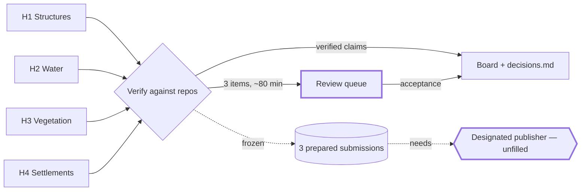

This is a real 884-line plan reduced to its Review Card. Every fact below already existed in
that file — it was spread across 590 lines before the first thing the reviewer had to decide.
Nothing was invented to shorten it. Names are changed; the shape is not.

---

# Design run 2 — four-handoff integration

> **Verdict.** Reconciles four parallel agents' handoffs into one board, one decisions ledger and
> one ordered review queue, verifying every closing claim against the repos instead of relaying it.
> Phase 0 records verified state on "build"; publication and every status change wait on a gate.
> **Effort** one session + ~80 min of review · **Risk** med — two unpublished submissions
> both write the shared `terrain` object · **Blast radius** planning-repo commits only

## At a glance

- **Outcome** — One board, one ledger, one ordered review queue. Nothing published, nothing `done`
- **Approach** — Check every claim against repo, hash, commit and render, then one central edit pass
- **Touches** — the planning repo (board, `decisions.md`); the art repo read-only; 4 handoff records
- **New deps** — None. Gate 2 adds two CC0-1.0 asset packs, already manifested
- **Not in scope** — Publishing any submission · Gate 3+ · track C1c · any item reaching `done`
- **Exit test** — Counts recomputed once centrally and reconciling to 104 items; every status change carries a linked, **Mock**-labelled artifact
- **Open question** — Who publishes, and in what order — decisions 2 and 3

## System design

Bold-edged nodes are gates: nothing crosses them without the reviewer.

## Steps

1. **[Preserve the orphaned dirty buffer](#step-1--the-orphaned-dirty-buffer)** — `renders/settlements/c1b/`.
   *Exit:* dated copy written and SHA-256 recorded. Blocks every other editor action.
2. **Board edits** — C1b and C1h to `blocked`, three corpus defects, Q17–Q18, X38–X47.
   *Exit:* every row carries an evidence link and a **Mock** label.
3. **Append six rows to `decisions.md`** — append-only, nothing reordered.
   *Exit:* no existing row edited, confirmed by diff.
4. **[Recompute counts centrally, once](#step-4--why-counts-are-central)** — not per handoff.
   *Exit:* reconciles to 104 — 51 track items, 37 deferred, 16 questions.
5. **Commit, one Conventional Commit per logical step** — planning `main`.
   *Exit:* governance check and log attempted around each.
6. **Hold for Gate 1 (C1b) and Gate 2 (structures)** — no further work until both answer.
   *Exit:* the reviewer's exact wording and date recorded verbatim.

## Decisions for the reviewer

> **1. The orphaned dirty buffer — preserve, preserve and close, or discard?**
> *Recommend* preserve to a dated copy and leave the process alone — the standing guard says so and
> this scene has been preserved this way before.
> *Alternative* discard, if the four-day-old district review is known-superseded.

> **2. Who is the designated publisher, or does publication stay frozen?**
> *Recommend* name one — three prepared submissions cannot move, and no owner will attest for another.
> *Alternative* stay frozen; all three submissions remain immutable and nothing is lost.

> **3. If a publisher is named, what is the publication order?**
> *Recommend* the standing rule as written — water re-projects against the published
> revision, never an old vegetation scene overwriting it.
> *Alternative* publish vegetation's canopy attachment first and re-run water's 28 m gate after.

> **4. Q17 — does C1h's exit accept the 7 km and 20 km pair, or require a strategic band?**
> *Recommend* accept the pair; the gallery is complete at both bands and a third render is new work.
> *Alternative* require it, and C1h stays `blocked` until that pass exists.

> **5. Q18 — do water and vegetation get board items, or stay tracked by their specs?**
> *Recommend* board items — both are authorized and active, and the register still calls the 28 m
> rebuild "scoped, not authorised", which is now false.
> *Alternative* leave both to their specs and just amend X19's stale text.

## Risks

- **Shared `terrain` is written by two unpublished submissions** — publication order is a
  correctness constraint, not a preference; everything stays frozen until decisions 2 and 3.
- **Two editor windows both show "C1b"** — the queue names one process explicitly; judging the
  other judges a four-day-old revision.
- **Track D is the critical path and no agent is on it** — D1 waits on B2c, which is `not started`.

---

# Addendum

<The other 800 lines go here: the gate register, the ID ledger, the touch matrix, the four
per-handoff verification sections, the licensing record, the review-queue scripts, the
per-track assessment. One `## Step N — <title>` heading for each step the card anchors to.>
