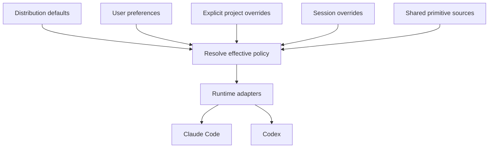

# How the shared harness works

A rule is written, given a detector or a stated reason it cannot have one, held to that by lint,
and then measured. Everything below serves that loop. Your preferences select behavior from a
shared primitive catalog, and the Claude Code and Codex adapters project that selection into each
one's native instructions, skill discovery, roles, workflows, settings and hooks. The agent runtime
remains responsible for its native permissions and restrictions.

## The rule lifecycle

Rules are the one primitive with a measurement loop around them, and it runs in five steps.

1. **Write the rule.** One instruction per line under `primitives/rules/`, in second person, with
   the reasoning in the skill it points at rather than in the rule file itself.
2. **Name a detector, or say why there cannot be one.** A detector in
   `claude/hooks/rule-detectors.py` decides from the transcript alone, deterministically, whether
   the rule was in play. A rule about tone, altitude or honesty carries a one-line `OPT_OUT` reason
   instead, and is then dark on purpose rather than by omission.
3. **Lint enforces the choice.** `check_detectors` in `bin/harness` fails the commit on a rule that
   has neither, so an unmeasured rule cannot arrive quietly.
4. **The report says what fired.** `harness usage --rules` counts hits per rule over the window,
   `--by repo` per repository and `--by stance` per `dimension=variant`, so a hit rate can be read
   against the preference variant that was selected at the time. Thresholds, and what the numbers
   do not support, are in [usage](usage.md).
5. **Prune what never fires.** A detector the report marks `unobserved` across enough measured
   sessions is evidence about the rule. Two of this repository's own shipped features were measured
   doing nothing and filed as bugs on that evidence; [the field scan](field-scan.md) names both,
   along with the gaps that qualify every figure — detector validity is unmeasured, and per-variant
   rates are observational rather than an A/B.

## The authority and its projections



Resolution precedence is defaults, user, explicit project, then session. User-level sync projects
only user defaults; lifecycle hooks resolve invocation overrides without mutating global links.
`harness stances --json` shows source, behavior and adapter coverage. Native restrictions always
win. [Custom stance authoring](primitive-authoring.md) defines naming, roots and conflicts.

Rules hold standing behavior. Stances make personal choices explicit and switchable; they are one
capability here among several, and three of the nine axes bind to enforcement while the rest are
prose that swaps cleanly. Skills hold procedures. Roles define responsibility, context and authority; native bindings select tools,
models and effort. Workflows compose those pieces, while presentation defines output shape.
All are authored under `primitives/`. The `claude/` compatibility paths are projections, not
another source. Custom stances belong outside the distribution checkout.

`policy/hooks/` contains shared classifiers, gates and detectors. `lib/harness_core/lifecycle.py`
composes decisions; each adapter translates native events. Registration is separate from trust
and activation. Enforcement gaps belong in [runtime controls](runtime-controls.md) and the
[compatibility catalog](compatibility.md), not in claims that all hooks always enforce policy.

The `cost` stance adds a resolved table on top of that selection — switches for the session, and a
class, an effort and a soft budget for each role and band — which `policy/hooks/posture.py`
resolves once for the dispatcher and every hook alike. Two facts shaped where it can act. A native
subagent's reasoning effort exists only in an agent definition and not in the spawn call, so the
posture reaches a spawn by being written into that definition at sync time, and an unnamed spawn
is routed to a band worker that carries one — in a session whose agent registry holds that worker,
because it did at startup or because the runtime has since said it reloaded one, and otherwise not
at all. And an agent can only budget what it can count, so
the budget in a brief and the feed that reports against it both come from the same local
measurements. What each variant sets: [preferences](preferences.md#what-a-session-costs). How it
is written: [primitive authoring](primitive-authoring.md). What is measured, and what is not:
[usage](usage.md).

One spawn, drawn top to bottom, before and after that layer:
[delegation before the cost posture layer](diagrams/delegation-before.html)
([image](diagrams/delegation-before-1440.png)) and
[delegation with it](diagrams/delegation-with-cost-posture.html)
([image](diagrams/delegation-with-cost-posture-1440.png)). The example budgets in the second are the shipped
`balanced` rows, seeded from one machine's measured p75; [re-seed them](usage.md) from your own.

## Working with installed files

[Sync and ownership](sync-model.md) explains links, generated files, structural merges,
configuration homes and rollback. Keep the shared checkout stable and change it through worktrees.
`harness generate --check` detects stale source projections, and `harness diff` compares installed
artifacts against their recorded state. Personal data stays outside the repository. Keep a personal
writing-voice profile in your preserved personal instructions; see [identity](preferences.md#identity).

[BMad integration and handoffs](bmad.md) keep framework state and task continuation independent of
runtime transcripts. [Usage](usage.md) records measurements with explicit gaps. [Preferences](preferences.md)
explains preset choices; [the stance demonstration](stance-demo.md) shows one switch reaching both
runtimes and a custom extension.

## Context discipline

The core instruction/rule/stance budget remains linted. Skills and detailed presentation load on
demand. Runtime-generated instructions and native client context still require qualification;
passing a source budget is not evidence about a model's total context or compliance.

**The cap that binds is tokens, not lines.** No runtime truncates what this layer measures: Claude
Code loads a CLAUDE.md of up to 4 MiB in full and skips a larger one, its 200-line limit applies
only to auto-memory `MEMORY.md`, and its "target under 200 lines" is authoring advice for one file
rather than a sum over many ([memory docs](https://code.claude.com/docs/en/memory)). What the layer
does cost is measured: issue #430 put the harness's live standing context at 12,607 tokens against
a bare profile, stable to +/- 15 across eight task pairs. `ALWAYS_LOADED_TOKEN_CAP` is a third of
that figure, so instructions, rules and the longest variant of every stance may hold a third of the
prefix and no more. The 200-line cap stays as a secondary guard, because a layer that is cheap in
tokens but sprawls over hundreds of short lines is still hard to read and hard to obey. Tokens are
characters over four, the same tokenizer-free approximation `scripts/cost_bench.py` uses; `harness
lint` prints both measures against both caps on every run and fails on either.

## Rationale relocated from the rules

The sentences below explain rules that now state only the instruction.

- **Never open a PR on unverified work**, because a PR that fails lint burns a reviewer's
  attention on nothing. Record the expected clean-tree output in the repo's agent instructions the
  first time you run the gates: the exact "all checks passed" line, the test count, the known
  benign warning. Then any deviation is yours, and you can tell a pre-existing failure from one
  you caused. Test auth anonymously, with redirects not followed: a test that follows redirects to
  a login page and asserts 200 proves nothing.
- **Reasoned pushback on review comments** means assessing legitimacy against the actual codebase
  first — actionable, already-resolved, banter, or informational — and, when the analysis disagrees
  with a reviewer (especially one phrased as suspicion rather than directive), drafting a reasoned
  rebuttal rather than complying blanket.
- **Provisioning commands are gated, and that gate is not yours to lift.** When a permission
  classifier refuses a deploy or apply command, build and validate everything, run the read-only
  plan or diff, and hand the user the exact commands. Run a wrapper only when the user has named it
  themselves.
- **Escalate sparingly in autonomous loops.** Review rounds are capped at two to three per story;
  the cap is a cap, not a target.
- **"Should work" is not a status**, and when an error is reported you read the actual error and
  the logs before the source — never theorize from the code alone.
- **A secret in a committed file does not become unleaked when you delete it**; history keeps it,
  which is why the credential must be rotated before anything else happens. Agent rule directories
  are the case that rule exists for: they feel private and are not. Read credentials from the
  environment instead:

  ```bash
  # Correct
  curl -H "Authorization: token $SERVICE_TOKEN" ...

  # Wrong — never do this
  curl -H "Authorization: token abc123def456" ...
  ```

  Cloud CLIs resolve credentials from a profile or a secret store; use `--profile` or an
  environment variable, never a pasted key.
