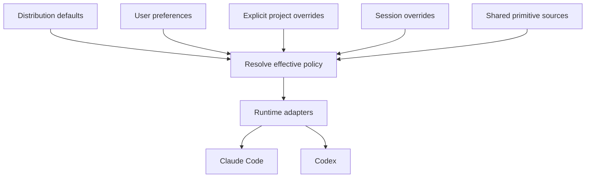

# How the shared harness works

Your preferences select behavior from a provider-independent primitive catalog. Runtime adapters
project that selection into native instructions, skill discovery, roles, workflows, settings and
hooks. The agent runtime remains responsible for its native permissions and restrictions.

## The authority and its projections



Resolution precedence is defaults, user, explicit project, then session. User-level sync projects
only user defaults; lifecycle hooks resolve invocation overrides without mutating global links.
`harness stances --json` shows source, behavior and adapter coverage. Native restrictions always
win. [Custom stance authoring](primitive-authoring.md) defines naming, roots and conflicts.

Rules hold standing behavior. Stances make personal choices explicit and switchable. Skills hold
procedures. Roles define responsibility, context and authority; native bindings select tools,
models and effort. Workflows compose those pieces, while presentation defines output shape.
All are authored under `primitives/`. The `claude/` compatibility paths are projections, not
another source. Custom stances belong outside the distribution checkout.

`policy/hooks/` contains shared classifiers, gates and detectors. `lib/harness_core/lifecycle.py`
composes decisions; each adapter translates native events. Registration is separate from trust
and activation. Enforcement gaps belong in [runtime controls](runtime-controls.md) and the
[compatibility catalog](compatibility.md), not in claims that all hooks always enforce policy.

## Working with installed files

[Sync and ownership](sync-model.md) explains links, generated files, structural merges,
configuration homes and rollback. Keep the shared checkout stable and change it through worktrees.
`harness generate --check` detects stale source projections, and `harness diff` compares installed
artifacts against their recorded state. Personal data stays outside the repository. Keep a personal
writing-voice profile in your preserved personal instructions; see [identity](preferences.md#identity).

[BMad integration and handoffs](bmad.md) keep framework state and task continuation independent of
runtime transcripts. [Usage](usage.md) records measurements with explicit gaps. [Preferences](preferences.md)
explains preset choices; [the stance demonstration](stance-demo.md) shows one switch reaching both
runtimes and a custom extension.

## Context discipline

The core instruction/rule/stance budget remains linted. Skills and detailed presentation load on
demand. Runtime-generated instructions and native client context still require qualification;
passing a source budget is not evidence about a model's total context or compliance.

## Rationale relocated from the rules

The sentences below explain rules that now state only the instruction.

- **Never open a PR on unverified work**, because a PR that fails lint burns a reviewer's
  attention on nothing. Record the expected clean-tree output in the repo's agent instructions the
  first time you run the gates: the exact "all checks passed" line, the test count, the known
  benign warning. Then any deviation is yours, and you can tell a pre-existing failure from one
  you caused. Test auth anonymously, with redirects not followed: a test that follows redirects to
  a login page and asserts 200 proves nothing.
- **Reasoned pushback on review comments** means assessing legitimacy against the actual codebase
  first — actionable, already-resolved, banter, or informational — and, when the analysis disagrees
  with a reviewer (especially one phrased as suspicion rather than directive), drafting a reasoned
  rebuttal rather than complying blanket.
- **Provisioning commands are gated, and that gate is not yours to lift.** When a permission
  classifier refuses a deploy or apply command, build and validate everything, run the read-only
  plan or diff, and hand the user the exact commands. Run a wrapper only when the user has named it
  themselves.
- **Escalate sparingly in autonomous loops.** Review rounds are capped at two to three per story;
  the cap is a cap, not a target.
- **"Should work" is not a status**, and when an error is reported you read the actual error and
  the logs before the source — never theorize from the code alone.
- **A secret in a committed file does not become unleaked when you delete it**; history keeps it,
  which is why the credential must be rotated before anything else happens. Agent rule directories
  are the case that rule exists for: they feel private and are not. Read credentials from the
  environment instead:

  ```bash
  # Correct
  curl -H "Authorization: token $SERVICE_TOKEN" ...

  # Wrong — never do this
  curl -H "Authorization: token abc123def456" ...
  ```

  Cloud CLIs resolve credentials from a profile or a secret store; use `--profile` or an
  environment variable, never a pasted key.
