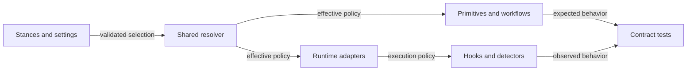

# Complete the stance and settings contract

> Make workflow preferences effective across the entire harness while keeping authorization, honesty and secret protection invariant.
> Build on the shared primitive architecture, move hidden opinions into explicit choices, and test selection through execution.
> **Changed this round.** Approved PR #115 as base · shared resolution first · retain the custom-primitives product pitch.
> Effort: substantial · Risk: policy drift · Blast radius: generated instructions, workflows, runtime hooks and user configuration.

## At a glance

- **Outcome:** Every audited preference has an explicit choice and a verified implementation contract.
- **Approach:** Repair existing switches, extract fixed preferences, then validate interacting selections.
- **Touches:** Shared primitives, resolver, runtime adapters, hooks, tests, configuration and documentation.
- **New deps:** None; reuse the shared primitive and runtime foundation tracked in #93–#100.
- **Not in scope:** Merging the existing PR stack, native-client qualification, deployment or changes to live user settings.
- **Exit test:** All fourteen child issues pass their acceptance checks, local gates and required PR checks.
- **Open question:** None; implementation on PR #115 is explicitly authorized.

## System design


One effective selection governs guidance and enforcement; native restrictions remain the ceiling.

## Steps

1. **[Establish the base](#step-1--base-and-tracking)** — link every change to an issue and confirm implementation sequencing.
   *Exit:* all child issues exist and the base decision is recorded before implementation starts.
2. **[Repair selection semantics](#step-2--selection-contract)** — fix voice/cost contradictions and define policy ownership.
   *Exit:* off/on/off, override and user-value restoration tests pass in both projections.
3. **[Extract fixed preferences](#step-3--existing-opinions)** — add verification, external-action, delegation, decision and documentation controls.
   *Exit:* each alternative resolves without contradictory rules, workflows or skills.
4. **[Add missing alternatives](#step-4--new-choices)** — deliver review, build-versus-buy, change-scope and research policies.
   *Exit:* all variants and the critical delegation/review interactions pass contract tests.
5. **[Configure runtime mechanics](#step-5--settings-and-runtime-behavior)** — resolve budgets, telemetry and gate behavior centrally.
   *Exit:* boundary, timeout, retention, disabled-collection and adapter tests pass.
6. **[Validate and document](#step-6--verification-and-migration)** — exercise migration, ownership and the six policy surfaces.
   *Exit:* CI-equivalent gates, floor/current Python, isolated sync and applicable projection checks pass on HEAD.
7. **[Review and merge](#step-7--delivery)** — publish verified, issue-linked changes without closing unimplemented work.
   *Exit:* required checks are green on the current head and completed issues close through merged implementation.

## Decisions for the reviewer

None — implementation on PR #115 is approved. Merge only after upstream dependencies land.

## Risks

- **Concurrent architecture changes:** refresh the base and reconcile affected contracts before each implementation PR.
- **Preference mistaken for permission:** native restrictions, repository requirements and user authorization always constrain execution.
- **Configuration growth:** preserve defaults, provide presets, and keep advanced questions optional rather than lengthening every setup.

---

# Addendum

## Step 1 — Base and tracking

Initial plan status: proposed. Implementation is now authorized on PR #115; acceptance evidence determines delivery. The user requested issues, a plan,
testing, a PR and merge. The plan PR can merge independently; it does not close implementation issues.
The user subsequently selected the last PR as the implementation base. This amendment records that
explicit approval; it does not authorize merging the pre-existing foundation stack.

The installed source is v0.8.0, commit `f9591ba`. The pending foundation is the PR stack
[#101](https://github.com/JakeSelby/agent-harness/pull/101) through
[#115](https://github.com/JakeSelby/agent-harness/pull/115), whose inspected head is `3be4cc4`.
The latter introduces shared primitive authority, runtime lifecycle policy and isolated role workers.
It remains an open draft stack with unresolved native acceptance; do not merge it as a side effect.

Track this work under [epic #116](https://github.com/JakeSelby/agent-harness/issues/116).
Each child issue owns its detailed acceptance criteria; the following links are the delivery map:

1. [#117 — Effective existing selections](https://github.com/JakeSelby/agent-harness/issues/117).
2. [#118 — Verification policy](https://github.com/JakeSelby/agent-harness/issues/118).
3. [#119 — External-action authorization](https://github.com/JakeSelby/agent-harness/issues/119).
4. [#120 — Delegation topology](https://github.com/JakeSelby/agent-harness/issues/120).
5. [#121 — Decision interaction](https://github.com/JakeSelby/agent-harness/issues/121).
6. [#122 — Documentation and history](https://github.com/JakeSelby/agent-harness/issues/122).
7. [#123 — Context lifecycle and budgets](https://github.com/JakeSelby/agent-harness/issues/123).
8. [#124 — Review depth and independence](https://github.com/JakeSelby/agent-harness/issues/124).
9. [#125 — Build-versus-buy alternatives](https://github.com/JakeSelby/agent-harness/issues/125).
10. [#126 — Change scope](https://github.com/JakeSelby/agent-harness/issues/126).
11. [#127 — Research depth](https://github.com/JakeSelby/agent-harness/issues/127).
12. [#128 — Observability controls](https://github.com/JakeSelby/agent-harness/issues/128).
13. [#129 — Gate behavior](https://github.com/JakeSelby/agent-harness/issues/129).
14. [#130 — Coverage, migration and documentation](https://github.com/JakeSelby/agent-harness/issues/130).

## Step 2 — Selection contract

Use four policy classes:

- **Invariants:** truthful results, uncertainty, secret protection, authorization and native restrictions.
- **Stances:** meaningful behavioral alternatives a reasonable user might prefer.
- **Settings:** bounds, durations, retention and execution mechanics.
- **Presets:** documented starting selections, never locks that override explicit user settings.

Author in `primitives/` on the pending foundation, using `lib/harness_core/catalog.py` and the
existing configuration resolver. Do not build a second stance catalog in `claude/` or Codex files.
`policy/hooks/` and `lib/harness_core/lifecycle.py` own runtime behavior; adapters project it.
Before editing, re-read those paths at the selected base because the pending stack may change them.

Keep default → user → explicitly selected project → session precedence for stance choices.
Retain the existing restriction that project configuration can select stances, not permission,
identity or runtime targets. New operational settings belong in user configuration initially;
session overrides must be explicitly whitelisted and validated. Cost supplies numeric defaults,
then explicit settings override them. No task/session value may persist into another session.

Define `off` per dimension: it removes the harness preference, not higher-priority constraints.
Preserve and restore user-owned values during ownership transitions; never simply delete a user's
output style because the harness stops managing it. Unknown selections fail before mutation.

The ownership record for every policy names six surfaces: rule text, skills, workflows, settings,
hooks and detectors. Mark inapplicable surfaces explicitly. Test behavior, not only file existence.

## Step 3 — Existing opinions

The proposed selections and migration defaults are:

- **Verification:** `local-first` (default), `ci-authoritative`, `hybrid`; independent of test-writing requirements.
- **Integration tests:** `fixtures-only` (default), `explicit-live`, `repo-native`; no implied endpoint authorization.
- **External actions:** `draft-first` (default), `explicit-request`, `scoped-standing-authority`.
- **Delegation writes:** `serial` (default), `isolated-worktrees`; `max_delegation_depth=1` means root-to-child only.
- **Decision interface:** `prose` (default), `structured`, `adaptive`; preserve explicit approval regardless of UI.
- **Documentation:** `concise-reference` (default), `explanatory`, `repo-native`.
- **Document history:** `append-only` (default), `living`; applied migrations and audit evidence stay protected.

External-action scopes name action, destination and expiration/revocation. Do not use a prose stance
as proof of runtime enforcement or as a bypass for a native denial. Constrained workers remain
unable to redelegate; any future worker contract change needs its own confinement evidence.

Adjust all consuming skills and workflows, including authoring, plan, build and review. Separate
public-facing document requirements from private engineering references. Respect repository PR
templates without imposing one universal amount of prose.

## Step 4 — New choices

- **Review:** `scope-and-quality` (default), `self-check`, `independent`, `risk-adaptive`.
- **Review independence:** `fresh-context` (default), `different-family`; report unavailable independence explicitly.
- **Build versus buy:** retain `capability-ceiling` as default and `off`; add `delivery-speed`, `operational-maturity`, `balanced`.
- **Change scope:** `minimal-diff` (default), `local-cleanup`, `systemic-fix`; none permits unrelated work.
- **Research:** `source-led` (default), `quick-check`, `exhaustive`; all retain attribution and uncertainty.

The explicit fresh-context default resolves the old ambiguous rule combining family and context;
record this as a policy clarification in migration notes rather than claiming byte-identical behavior.
When delegation is off, do not silently launch a reviewer. Report that independent review remains
unperformed, or use self-check only when the selected policy/user allows it.

Risk-adaptive review must publish deterministic selection criteria before implementation: trivial
presentation-only edits may self-check; logic changes require independent review; authorization,
secrets, persistence and migration changes require separate scope and quality review. Missing
capabilities cannot silently downgrade the required review.

## Step 5 — Settings and runtime behavior

- **Context:** `cost-default` (default), `preserve-cache`, `adaptive`, `handoff`.
- **Budgets:** gather/digest word caps, search count, fan-out and review rounds; preserve 400/600 return defaults.
- **Telemetry:** `observability.enabled=true`, `retention_days=0`, `include_repo=true`, `include_branch=true`.
- **Gates:** `gates.mode=blocking`, `gates.max_blocks=8`, `gates.timeout_seconds=240`; add `advisory` mode.

Retention zero means no automatic expiry, preserving current stored history. Opting out of metadata
affects new records; purging existing records is a separate explicit operation. Disabled telemetry
must stop detached workers and rescans as well as hook installation. Never add command or message
bodies to usage records. Test concurrent writers and UTC expiry boundaries.

Numeric schemas must reject booleans masquerading as integers, malformed values and invalid bounds.
Publish allowed ranges and provider hard-limit behavior before exposing each setting. A larger user
budget never overrides a provider limit. Do not hard-code current vendor limits as universal facts.

Advisory and exhausted blocking gates may release a turn; neither outcome proves the gate passed.
Preserve dirty-tree identity, trust, cancellation and error distinctions from the runtime foundation.

## Step 6 — Verification and migration

Read the current `.github/workflows/ci.yml` and `AGENTS.md` at the selected checkout before running
gates. The current plan branch requires:

```sh
python3 bin/harness lint
python3 -m unittest discover -s tests -v
python3 bin/harness sync --dry-run
```

For dry-run, run a subprocess with a temporary home containing only a copy of `config.example.json`;
do not overwrite the real configuration or install a candidate into the live harness. Preserve the
normal session environment outside that subprocess. No formatter is configured in the inspected CI;
check for new formatter requirements if the base changes.

On the shared-primitives foundation, also run `python3 bin/harness generate --check`. Run the test
suite under Python 3.9 and the current supported Python before implementation merges. Successful
source tests do not qualify native clients; exercise available adapters and explicitly report any
blocked native probe. Do not remove a native qualification gate to ship this work.

Required interaction coverage includes cost/context, voice/style ownership, review/delegation,
testing/verification/gates and autonomy/external-actions. Cover every variant individually plus
these meaningful pairs; do not claim an exhaustive Cartesian product was exercised. Include old
configuration migration, repeated sync, uninstall restoration, invalid combinations, session scope
and custom stances introduced by the foundation.

Keep the always-loaded context budget: extract rationale into skills/docs, measure the longest
variant in each dimension and avoid raising the cap merely to fit more switches. Offer presets
and an optional advanced configuration path; do not ask every new question on every initialization.

## Step 7 — Delivery

Use one coordinated implementation PR for this shared policy contract, with each child issue mapped to its acceptance evidence.
Keep writes single-threaded under the current policy. Use isolated worktrees and leave unrelated
work untouched. The earlier plan-only PR is merged. This implementation is one coordinated policy-contract change
with issue-specific acceptance coverage; its stacked PR references all fourteen child issues.

For implementation, run gates on committed HEAD in the checkout being pushed. Fill every PR
template section and reference its issue. Inspect check status after the last push; squash merge
through repository protection without administrative bypass. Recheck the merge result and issue
status. If the approved base is stacked, merge only after the existing dependencies land, then
refresh and rerun the gates on the resulting main-based diff.

Retain “Your way of working, across AI agents” and the user-approved custom-primitives pitch.
Qualify absolute claims about every opinion; explain what each switch changes. Describe support separately as guidance, source-tested enforcement or native-tested
enforcement. Retain evidence and limitations rather than claiming all preferences are equally
enforceable on every client. Close the epic only when all child acceptance criteria are satisfied.

## Implementation amendment

Shared resolution is the first dependency. Reuse the existing custom catalog and ownership ledger.
External scopes and writer scheduling are explicit policy inspectors, not universal connector
interception or a census of native agents. Keep guidance and enforced controls distinct in
[the policy contract](../policy-contract.md). Native-client qualification remains with the foundation.
